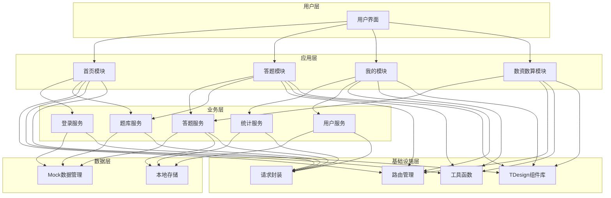
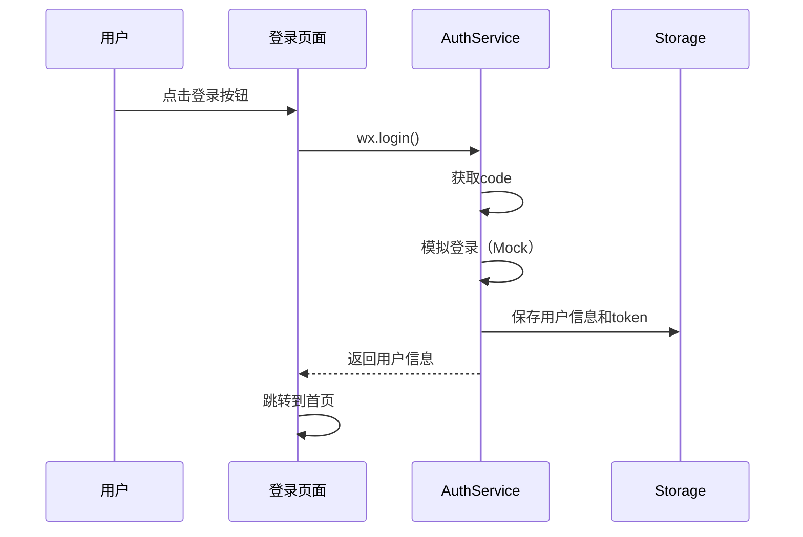
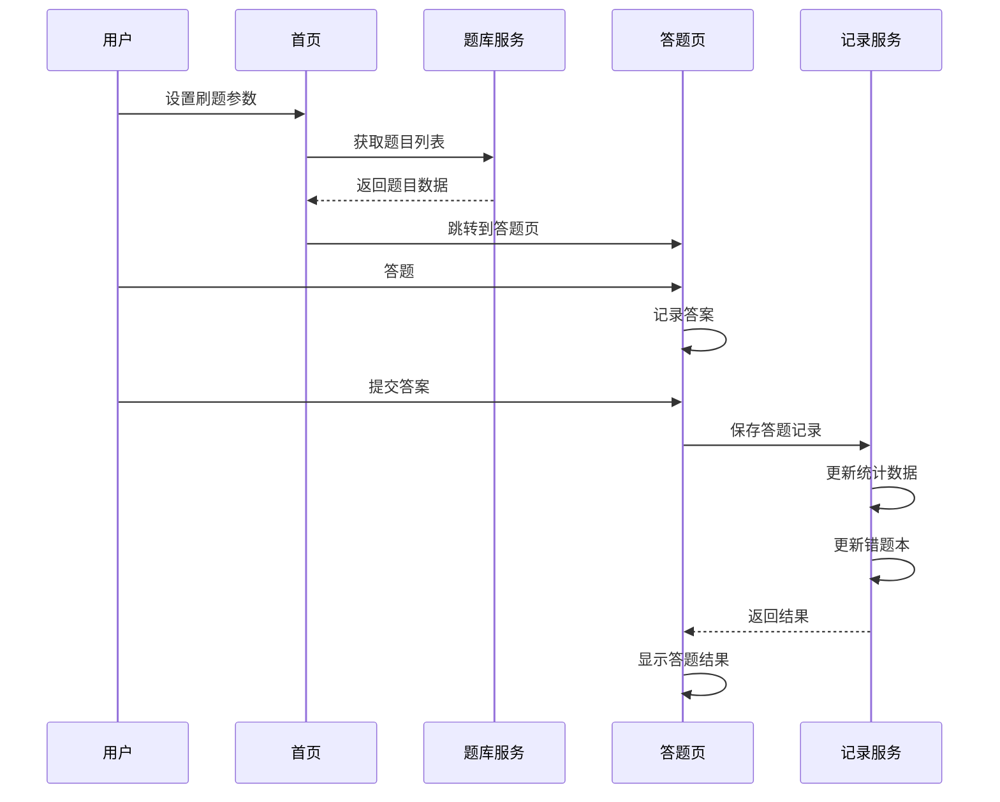
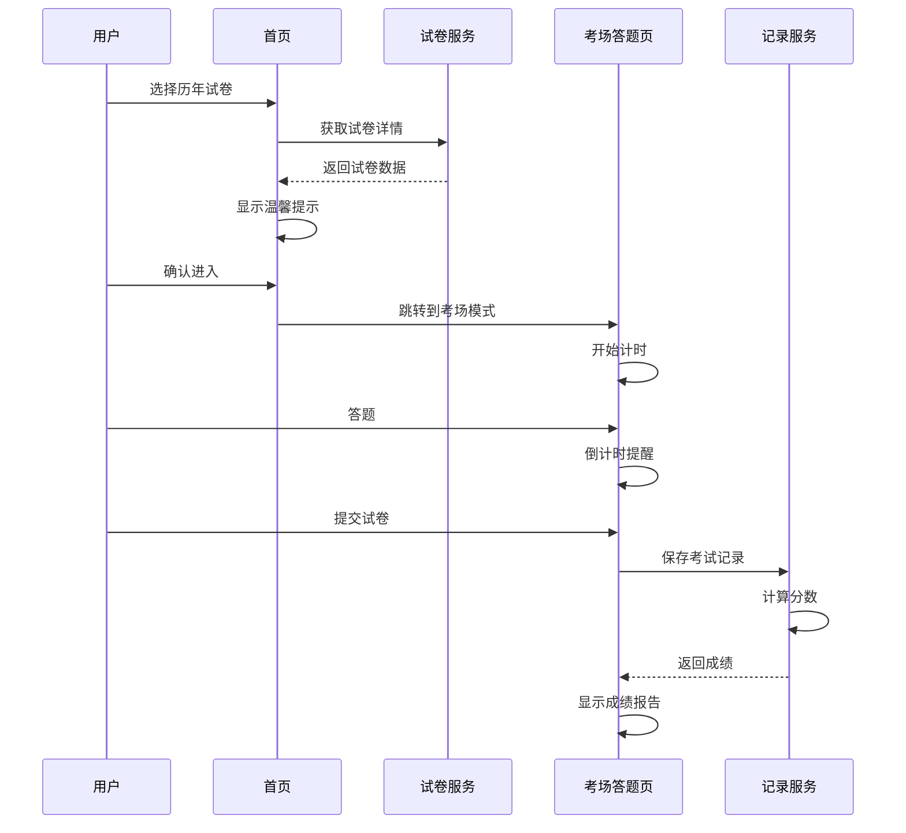

# 设计文档：公考刷题小程序

## 概述

本项目基于 xcx-software 微信小程序基座（Skyline 渲染引擎），开发一个功能完整的公考刷题小程序。项目采用微信小程序原生开发技术栈（WXML + WXSS + JavaScript），集成 TDesign 组件库，实现像素级还原参考设计。

核心功能包括：考试类型切换、多模式刷题（刷题模式/解析模式/考场模式）、答题卡管理、错题本、收藏、练习记录、刷题报告、刷题日历等。所有数据使用 Mock 数据，不依赖后端服务。

技术特点：
- 复用基座的路由管理、请求封装、工具函数等基础设施
- 组件化设计（全局组件 + 页面组件）
- 分包加载（主包 + 功能分包）
- 登录态控制和权限管理
- 支持暗黑模式、涂鸦功能等高级特性

## 系统架构

### 整体架构图



### 技术架构说明

1. **用户层**：微信小程序前端界面，基于 Skyline 渲染引擎
2. **应用层**：四大核心模块（首页、答题、我的、数资数算）
3. **业务层**：封装业务逻辑的服务层
4. **数据层**：Mock 数据管理 + 本地存储（用户答题记录、收藏、错题等）
5. **基础设施层**：复用基座提供的路由、请求、工具、组件库


## 模块划分

### 主包模块（Main Package）

**1. 首页模块（Home）**
- 考试类型切换（国考/省考/事业单位等）
- 刷题设置（题目数量、题型、考点选择）
- 考场模式入口
- 历年试卷列表
- 考点结构树
- Tab 栏显示设置

**2. 登录模块（Auth）**
- 微信授权登录
- 用户信息获取
- 登录态管理

**3. 我的模块（Profile）**
- 个人信息展示
- 错题本入口
- 收藏夹入口
- 练习记录入口
- 刷题报告入口
- 刷题日历入口
- 问题建议

### 独立分包模块（Independent Sub Packages）

**1. 行测刷题分包（Practice-Xingce）- 独立分包**
- 刷题模式答题页
- 解析模式答题页
- 考场模式答题页
- 答题卡组件（分包内）
- 涂鸦组件（分包内）
- 答题结果页
- 暗黑模式支持
- 错题本列表页
- 收藏列表页
- 练习记录列表页
- 刷题报告页
- 刷题日历页

**2. 数资数算分包（Practice-Math）- 独立分包**
- 数资数算专项首页
- 数资数算答题页
- 计算器组件（分包内）
- 草稿纸组件（分包内）

**3. 答题卡功能分包（AnswerSheet）- 独立分包**
- 答题卡扫描
- 答题卡下载
- 答题卡预览

### 预留独立分包（Future Independent Sub Packages）

**4. 申论分包（Practice-Shenlun）- 预留**
- 申论题目列表
- 申论答题页
- 申论批改页
- 申论范文库

**5. 面试分包（Practice-Interview）- 预留**
- 面试题目列表
- 面试答题页
- 面试评分页
- 面试技巧库

**6. 课程分包（Course）- 预留**
- 课程列表
- 课程详情
- 视频播放
- 课程笔记

**7. 社群分包（Community）- 预留**
- 讨论区
- 学习小组
- 打卡广场
- 排行榜


## 组件结构

### 主包全局组件（Main Package Global Components）

```
miniprogram/components/
├── navigation-bar/          # 自定义导航栏（基座已有）
├── exam-type-selector/      # 考试类型选择器
└── tab-bar/                 # 自定义 TabBar（如需要）
```

### 主包页面组件（Main Package Page Components）

**首页模块组件**
```
miniprogram/pages/home/components/
├── exam-type-modal/         # 考试类型弹窗
├── practice-settings/       # 刷题设置面板
├── exam-mode-card/          # 考场模式卡片
├── paper-list-item/         # 试卷列表项
└── knowledge-tree/          # 考点结构树
```

**我的模块组件**
```
miniprogram/pages/profile/components/
├── user-info-card/          # 用户信息卡片
└── menu-grid/               # 功能菜单网格
```

### 行测刷题分包组件（Practice-Xingce Sub Package Components）

**分包内全局组件**
```
miniprogram/subpackages/practice-xingce/components/
├── question-card/           # 题目卡片组件
├── answer-option/           # 答案选项组件
├── answer-sheet-grid/       # 答题卡网格组件
├── answer-sheet-panel/      # 答题卡面板
├── material-question/       # 材料题组件
├── drawing-board/           # 涂鸦画板
├── settings-panel/          # 多功能设置面板
├── result-summary/          # 答题结果汇总
├── statistics-card/         # 统计卡片组件
├── calendar-heatmap/        # 刷题日历热力图
├── record-list-item/        # 练习记录列表项
├── wrong-question-item/     # 错题列表项
└── collection-item/         # 收藏列表项
```

### 数资数算分包组件（Practice-Math Sub Package Components）

```
miniprogram/subpackages/practice-math/components/
├── calculator/              # 计算器组件
├── draft-paper/             # 草稿纸组件
├── chart-question/          # 图表题组件
└── formula-input/           # 公式输入组件
```

### 答题卡功能分包组件（AnswerSheet Sub Package Components）

```
miniprogram/subpackages/answer-sheet/components/
├── scanner/                 # 扫描组件
├── sheet-preview/           # 答题卡预览
└── download-panel/          # 下载面板
```


## 数据模型

### 用户数据模型（User）

```javascript
interface User {
  id: string                    // 用户ID
  openid: string                // 微信openid
  nickName: string              // 昵称
  avatarUrl: string             // 头像URL
  phone?: string                // 手机号（可选）
  examType: string              // 当前选择的考试类型
  createdAt: number             // 注册时间戳
  lastLoginAt: number           // 最后登录时间戳
}
```

### 题目数据模型（Question）

```javascript
interface Question {
  id: string                    // 题目ID
  type: QuestionType            // 题目类型
  examType: string              // 考试类型
  subject: string               // 科目
  knowledgePoint: string        // 考点
  difficulty: number            // 难度（1-5）
  content: string               // 题目内容
  options?: Option[]            // 选项（选择题）
  answer: string                // 正确答案
  analysis: string              // 答案解析
  materialId?: string           // 材料ID（材料题）
  year?: number                 // 年份（历年真题）
  province?: string             // 省份
  imageUrl?: string             // 题目图片
  tags: string[]                // 标签
}

type QuestionType = 'single' | 'multiple' | 'judgment' | 'material'

interface Option {
  key: string                   // 选项标识（A/B/C/D）
  content: string               // 选项内容
  imageUrl?: string             // 选项图片
}
```

### 材料数据模型（Material）

```javascript
interface Material {
  id: string                    // 材料ID
  content: string               // 材料内容
  imageUrl?: string             // 材料图片
  questionIds: string[]         // 关联的题目ID列表
}
```


### 试卷数据模型（Paper）

```javascript
interface Paper {
  id: string                    // 试卷ID
  title: string                 // 试卷标题
  examType: string              // 考试类型
  year: number                  // 年份
  province?: string             // 省份
  subject: string               // 科目
  totalQuestions: number        // 总题数
  totalScore: number            // 总分
  duration: number              // 考试时长（分钟）
  questionIds: string[]         // 题目ID列表
  createdAt: number             // 创建时间
}
```

### 答题记录模型（PracticeRecord）

```javascript
interface PracticeRecord {
  id: string                    // 记录ID
  userId: string                // 用户ID
  mode: PracticeMode            // 答题模式
  paperId?: string              // 试卷ID（考场模式）
  questionIds: string[]         // 题目ID列表
  answers: Record<string, string> // 用户答案 {questionId: answer}
  correctCount: number          // 正确数量
  wrongCount: number            // 错误数量
  unansweredCount: number       // 未答数量
  score?: number                // 得分（考场模式）
  duration: number              // 答题时长（秒）
  startTime: number             // 开始时间戳
  endTime: number               // 结束时间戳
  isCompleted: boolean          // 是否完成
}

type PracticeMode = 'practice' | 'analysis' | 'exam'
```

### 错题数据模型（WrongQuestion）

```javascript
interface WrongQuestion {
  id: string                    // 记录ID
  userId: string                // 用户ID
  questionId: string            // 题目ID
  userAnswer: string            // 用户答案
  wrongCount: number            // 错误次数
  lastWrongTime: number         // 最后错误时间
  isMastered: boolean           // 是否已掌握
}
```


### 收藏数据模型（Collection）

```javascript
interface Collection {
  id: string                    // 收藏ID
  userId: string                // 用户ID
  questionId: string            // 题目ID
  note?: string                 // 笔记
  createdAt: number             // 收藏时间
}
```

### 刷题设置模型（PracticeSettings）

```javascript
interface PracticeSettings {
  examType: string              // 考试类型
  subject: string               // 科目
  questionTypes: QuestionType[] // 题型
  knowledgePoints: string[]     // 考点
  questionCount: number         // 题目数量
  difficulty?: number           // 难度筛选
  includeWrong: boolean         // 包含错题
  randomOrder: boolean          // 随机顺序
}
```

### 统计数据模型（Statistics）

```javascript
interface Statistics {
  userId: string                // 用户ID
  totalQuestions: number        // 总答题数
  correctCount: number          // 正确数
  wrongCount: number            // 错误数
  accuracy: number              // 正确率
  totalDuration: number         // 总时长（秒）
  practiceCount: number         // 练习次数
  continuousDays: number        // 连续天数
  dailyStats: DailyStat[]       // 每日统计
  subjectStats: SubjectStat[]   // 科目统计
}

interface DailyStat {
  date: string                  // 日期 YYYY-MM-DD
  questionCount: number         // 答题数
  correctCount: number          // 正确数
  duration: number              // 时长（秒）
}

interface SubjectStat {
  subject: string               // 科目
  questionCount: number         // 答题数
  correctCount: number          // 正确数
  accuracy: number              // 正确率
}
```


## 路由设计

### 主包路由

```javascript
const ROUTES = {
  // 首页模块
  HOME: '/miniprogram/pages/home/home',
  EXAM_MODE: '/miniprogram/pages/exam-mode/exam-mode',
  PAPER_LIST: '/miniprogram/pages/paper-list/paper-list',
  KNOWLEDGE_TREE: '/miniprogram/pages/knowledge-tree/knowledge-tree',
  
  // 登录模块
  LOGIN: '/miniprogram/pages/login/login',
  
  // 我的模块
  PROFILE: '/miniprogram/pages/profile/profile',
  WRONG_QUESTIONS: '/miniprogram/pages/wrong-questions/wrong-questions',
  COLLECTIONS: '/miniprogram/pages/collections/collections',
  PRACTICE_RECORDS: '/miniprogram/pages/practice-records/practice-records',
  PRACTICE_REPORT: '/miniprogram/pages/practice-report/practice-report',
  PRACTICE_CALENDAR: '/miniprogram/pages/practice-calendar/practice-calendar',
  USER_INFO: '/miniprogram/pages/user-info/user-info',
  FEEDBACK: '/miniprogram/pages/feedback/feedback',
  
  // 答题分包路由
  PRACTICE: '/miniprogram/subpackages/practice/pages/practice/practice',
  PRACTICE_RESULT: '/miniprogram/subpackages/practice/pages/result/result',
  
  // 数资数算分包路由
  MATH_HOME: '/miniprogram/subpackages/math/pages/home/home',
  MATH_PRACTICE: '/miniprogram/subpackages/math/pages/practice/practice',
  
  // 答题卡功能分包路由
  ANSWER_SHEET_SCAN: '/miniprogram/subpackages/answer-sheet/pages/scan/scan',
  ANSWER_SHEET_DOWNLOAD: '/miniprogram/subpackages/answer-sheet/pages/download/download',
}
```

### 路由跳转示例

```javascript
// 进入刷题页面
router.push('PRACTICE', {
  mode: 'practice',
  settings: JSON.stringify(practiceSettings)
})

// 查看答题结果
router.push('PRACTICE_RESULT', {
  recordId: 'xxx'
})

// 查看错题本
router.push('WRONG_QUESTIONS')
```


## 核心业务流程

### 登录流程



### 刷题流程



### 考场模式流程




## 关键页面代码结构

### 1. 首页（Home）

**文件结构**
```
pages/home/
├── home.js
├── home.json
├── home.wxml
├── home.wxss
└── components/
    ├── exam-type-modal/
    ├── practice-settings/
    └── exam-mode-card/
```

**核心逻辑（home.js）**
```javascript
const router = require('../../router/index')
const tool = require('../../toolbox/tool')
const examService = require('../../services/exam-service')
const questionService = require('../../services/question-service')

Page({
  data: {
    currentExamType: '国考',
    examTypes: ['国考', '省考', '事业单位', '选调生'],
    showExamTypeModal: false,
    practiceSettings: {
      questionCount: 20,
      questionTypes: ['single', 'multiple'],
      knowledgePoints: [],
      randomOrder: true
    },
    papers: [],
    knowledgeTree: []
  },

  onLoad() {
    this.checkLoginStatus()
    this.loadExamType()
    this.loadPapers()
    this.loadKnowledgeTree()
  },

  // 检查登录状态
  async checkLoginStatus() {
    const token = await tool.getStorage('token')
    if (!token) {
      router.redirect('LOGIN')
    }
  },

  // 加载考试类型
  async loadExamType() {
    const examType = await tool.getStorage('examType') || '国考'
    this.setData({ currentExamType: examType })
  },

  // 切换考试类型
  onExamTypeChange(e) {
    const examType = e.detail
    this.setData({ currentExamType: examType })
    tool.setStorage('examType', examType)
    this.loadPapers()
    this.loadKnowledgeTree()
  },

  // 开始刷题
  async startPractice() {
    const { practiceSettings } = this.data
    router.push('PRACTICE', {
      mode: 'practice',
      settings: JSON.stringify(practiceSettings)
    })
  },

  // 进入考场模式
  goToExamMode() {
    router.push('EXAM_MODE')
  }
})
```


### 2. 答题页（Practice）

**文件结构**
```
subpackages/practice/pages/practice/
├── practice.js
├── practice.json
├── practice.wxml
├── practice.wxss
└── components/
    ├── question-content/
    ├── material-question/
    ├── drawing-board/
    └── answer-sheet-panel/
```

**核心逻辑（practice.js）**
```javascript
const router = require('../../../../router/index')
const tool = require('../../../../toolbox/tool')
const questionService = require('../../../../services/question-service')
const recordService = require('../../../../services/record-service')

Page({
  data: {
    mode: 'practice',           // practice | analysis | exam
    questions: [],
    currentIndex: 0,
    answers: {},                // {questionId: answer}
    showAnswerSheet: false,
    showDrawingBoard: false,
    darkMode: false,
    startTime: 0,
    timer: null,
    duration: 0
  },

  onLoad(options) {
    const { mode, settings, paperId } = options
    this.setData({ mode, startTime: Date.now() })
    this.loadQuestions(settings, paperId)
    this.startTimer()
  },

  // 加载题目
  async loadQuestions(settings, paperId) {
    let questions = []
    if (paperId) {
      questions = await questionService.getQuestionsByPaper(paperId)
    } else {
      const config = JSON.parse(settings)
      questions = await questionService.getQuestions(config)
    }
    this.setData({ questions })
  },

  // 选择答案
  onSelectAnswer(e) {
    const { questionId, answer } = e.detail
    const { answers } = this.data
    answers[questionId] = answer
    this.setData({ answers })
  },

  // 上一题
  prevQuestion() {
    const { currentIndex } = this.data
    if (currentIndex > 0) {
      this.setData({ currentIndex: currentIndex - 1 })
    }
  },

  // 下一题
  nextQuestion() {
    const { currentIndex, questions } = this.data
    if (currentIndex < questions.length - 1) {
      this.setData({ currentIndex: currentIndex + 1 })
    }
  },

  // 提交答案
  async submitAnswers() {
    const confirm = await tool.modal('确定要提交答案吗？')
    if (!confirm) return

    const record = await this.saveRecord()
    router.redirect('PRACTICE_RESULT', { recordId: record.id })
  },

  // 保存答题记录
  async saveRecord() {
    const { mode, questions, answers, startTime } = this.data
    const endTime = Date.now()
    const duration = Math.floor((endTime - startTime) / 1000)

    const record = {
      mode,
      questionIds: questions.map(q => q.id),
      answers,
      duration,
      startTime,
      endTime
    }

    return await recordService.saveRecord(record)
  }
})
```


### 3. 我的页面（Profile）

**文件结构**
```
pages/profile/
├── profile.js
├── profile.json
├── profile.wxml
├── profile.wxss
└── components/
    └── user-info-card/
```

**核心逻辑（profile.js）**
```javascript
const router = require('../../router/index')
const tool = require('../../toolbox/tool')
const userService = require('../../services/user-service')
const statisticsService = require('../../services/statistics-service')

Page({
  data: {
    userInfo: null,
    statistics: {
      totalQuestions: 0,
      accuracy: 0,
      continuousDays: 0,
      practiceCount: 0
    },
    menuItems: [
      { icon: 'error', title: '错题本', path: 'WRONG_QUESTIONS' },
      { icon: 'star', title: '我的收藏', path: 'COLLECTIONS' },
      { icon: 'time', title: '练习记录', path: 'PRACTICE_RECORDS' },
      { icon: 'chart', title: '刷题报告', path: 'PRACTICE_REPORT' },
      { icon: 'calendar', title: '刷题日历', path: 'PRACTICE_CALENDAR' },
      { icon: 'user', title: '个人信息', path: 'USER_INFO' },
      { icon: 'chat', title: '问题建议', path: 'FEEDBACK' }
    ]
  },

  onShow() {
    this.loadUserInfo()
    this.loadStatistics()
  },

  // 加载用户信息
  async loadUserInfo() {
    const userInfo = await userService.getUserInfo()
    this.setData({ userInfo })
  },

  // 加载统计数据
  async loadStatistics() {
    const statistics = await statisticsService.getStatistics()
    this.setData({ statistics })
  },

  // 菜单项点击
  onMenuItemClick(e) {
    const { path } = e.currentTarget.dataset
    router.push(path)
  }
})
```


## 核心组件实现方案

### 1. 题目卡片组件（question-card）

**功能**：展示题目内容、选项、支持图片

**接口定义**
```javascript
Component({
  properties: {
    question: {
      type: Object,
      value: null
    },
    mode: {
      type: String,
      value: 'practice'  // practice | analysis | exam
    },
    userAnswer: {
      type: String,
      value: ''
    },
    showAnalysis: {
      type: Boolean,
      value: false
    }
  },

  methods: {
    onSelectOption(e) {
      const { key } = e.currentTarget.dataset
      this.triggerEvent('select', { 
        questionId: this.data.question.id, 
        answer: key 
      })
    }
  }
})
```

**WXML 结构**
```xml
<view class="question-card">
  <view class="question-header">
    <text class="question-type">{{question.type}}</text>
    <text class="question-difficulty">难度：{{question.difficulty}}</text>
  </view>
  
  <view class="question-content">
    <text>{{question.content}}</text>
    <image wx:if="{{question.imageUrl}}" src="{{question.imageUrl}}" />
  </view>
  
  <view class="question-options">
    <view 
      wx:for="{{question.options}}" 
      wx:key="key"
      class="option-item {{userAnswer === item.key ? 'selected' : ''}}"
      data-key="{{item.key}}"
      bindtap="onSelectOption">
      <text class="option-key">{{item.key}}</text>
      <text class="option-content">{{item.content}}</text>
      <image wx:if="{{item.imageUrl}}" src="{{item.imageUrl}}" />
    </view>
  </view>
  
  <view wx:if="{{showAnalysis}}" class="question-analysis">
    <text class="analysis-label">答案：{{question.answer}}</text>
    <text class="analysis-content">{{question.analysis}}</text>
  </view>
</view>
```


### 2. 答题卡组件（answer-sheet-panel）

**功能**：显示答题进度、快速跳转题目

**接口定义**
```javascript
Component({
  properties: {
    questions: {
      type: Array,
      value: []
    },
    answers: {
      type: Object,
      value: {}
    },
    currentIndex: {
      type: Number,
      value: 0
    }
  },

  methods: {
    onQuestionClick(e) {
      const { index } = e.currentTarget.dataset
      this.triggerEvent('jump', { index })
    },

    getQuestionStatus(questionId) {
      return this.data.answers[questionId] ? 'answered' : 'unanswered'
    }
  }
})
```

**WXML 结构**
```xml
<view class="answer-sheet-panel">
  <view class="sheet-header">
    <text>答题卡</text>
    <text class="progress">{{answeredCount}}/{{questions.length}}</text>
  </view>
  
  <view class="sheet-grid">
    <view 
      wx:for="{{questions}}" 
      wx:key="id"
      class="grid-item {{getQuestionStatus(item.id)}} {{currentIndex === index ? 'current' : ''}}"
      data-index="{{index}}"
      bindtap="onQuestionClick">
      <text>{{index + 1}}</text>
    </view>
  </view>
  
  <view class="sheet-legend">
    <view class="legend-item">
      <view class="legend-icon answered"></view>
      <text>已答</text>
    </view>
    <view class="legend-item">
      <view class="legend-icon unanswered"></view>
      <text>未答</text>
    </view>
    <view class="legend-item">
      <view class="legend-icon current"></view>
      <text>当前</text>
    </view>
  </view>
</view>
```


### 3. 涂鸦画板组件（drawing-board）

**功能**：支持手写涂鸦、橡皮擦、清空

**接口定义**
```javascript
Component({
  properties: {
    show: {
      type: Boolean,
      value: false
    }
  },

  data: {
    ctx: null,
    canvasWidth: 0,
    canvasHeight: 0,
    isDrawing: false,
    tool: 'pen',  // pen | eraser
    lineWidth: 2,
    color: '#000000'
  },

  lifetimes: {
    attached() {
      this.initCanvas()
    }
  },

  methods: {
    initCanvas() {
      const query = this.createSelectorQuery()
      query.select('#drawing-canvas')
        .fields({ node: true, size: true })
        .exec((res) => {
          const canvas = res[0].node
          const ctx = canvas.getContext('2d')
          
          const dpr = wx.getSystemInfoSync().pixelRatio
          canvas.width = res[0].width * dpr
          canvas.height = res[0].height * dpr
          ctx.scale(dpr, dpr)
          
          this.setData({ 
            ctx, 
            canvasWidth: res[0].width, 
            canvasHeight: res[0].height 
          })
        })
    },

    onTouchStart(e) {
      const { x, y } = e.touches[0]
      const { ctx, tool, lineWidth, color } = this.data
      
      ctx.beginPath()
      ctx.moveTo(x, y)
      ctx.lineWidth = lineWidth
      ctx.lineCap = 'round'
      ctx.lineJoin = 'round'
      
      if (tool === 'pen') {
        ctx.strokeStyle = color
      } else {
        ctx.strokeStyle = '#ffffff'
        ctx.lineWidth = 10
      }
      
      this.setData({ isDrawing: true })
    },

    onTouchMove(e) {
      if (!this.data.isDrawing) return
      
      const { x, y } = e.touches[0]
      const { ctx } = this.data
      
      ctx.lineTo(x, y)
      ctx.stroke()
    },

    onTouchEnd() {
      this.setData({ isDrawing: false })
    },

    clearCanvas() {
      const { ctx, canvasWidth, canvasHeight } = this.data
      ctx.clearRect(0, 0, canvasWidth, canvasHeight)
    },

    switchTool(e) {
      const { tool } = e.currentTarget.dataset
      this.setData({ tool })
    }
  }
})
```


### 4. 刷题日历热力图组件（calendar-heatmap）

**功能**：展示每日刷题数量的热力图

**接口定义**
```javascript
Component({
  properties: {
    dailyStats: {
      type: Array,
      value: []
    }
  },

  data: {
    calendar: [],
    maxCount: 0
  },

  observers: {
    'dailyStats': function(stats) {
      this.generateCalendar(stats)
    }
  },

  methods: {
    generateCalendar(stats) {
      const today = new Date()
      const calendar = []
      const statsMap = {}
      
      // 构建统计数据映射
      stats.forEach(stat => {
        statsMap[stat.date] = stat.questionCount
      })
      
      // 生成最近90天的日历
      for (let i = 89; i >= 0; i--) {
        const date = new Date(today)
        date.setDate(date.getDate() - i)
        const dateStr = this.formatDate(date)
        
        calendar.push({
          date: dateStr,
          count: statsMap[dateStr] || 0,
          level: this.getLevel(statsMap[dateStr] || 0)
        })
      }
      
      const maxCount = Math.max(...Object.values(statsMap), 0)
      this.setData({ calendar, maxCount })
    },

    getLevel(count) {
      if (count === 0) return 0
      if (count < 10) return 1
      if (count < 20) return 2
      if (count < 30) return 3
      return 4
    },

    formatDate(date) {
      const year = date.getFullYear()
      const month = String(date.getMonth() + 1).padStart(2, '0')
      const day = String(date.getDate()).padStart(2, '0')
      return `${year}-${month}-${day}`
    }
  }
})
```


## Mock 数据结构

### 题库 Mock 数据（mock-questions.js）

```javascript
const mockQuestions = [
  {
    id: 'q001',
    type: 'single',
    examType: '国考',
    subject: '行测',
    knowledgePoint: '言语理解-逻辑填空',
    difficulty: 3,
    content: '在市场经济条件下，企业要想达到自身获利的目的，必须首先生产或提供对他人有价值的东西。如果企业置他人利益于不顾，采取欺骗的手段进行不正当交换，不仅不被社会容忍，而且要受到法律惩罚。市场经济内在地要求企业遵循诚信、公平、负责等交换准则。这些交换准则，内含着维系和推动企业发展的道德力量。换言之，不具备道德力的企业、不对他人或社会负责任的企业，终将被淘汰出局。',
    options: [
      { key: 'A', content: '在市场经济中，道德力量是企业生存的基础' },
      { key: 'B', content: '在市场经济中，企业要想生存就必须遵循一定的道德准则' },
      { key: 'C', content: '在市场经济中，企业要想获利就必须首先生产对他人有价值的东西' },
      { key: 'D', content: '在市场经济中，企业如果不讲诚信，就会被淘汰出局' }
    ],
    answer: 'B',
    analysis: '文段首先指出企业要获利必须生产对他人有价值的东西，接着说明企业如果采取欺骗手段会受到惩罚，然后指出市场经济要求企业遵循诚信等准则，最后总结不具备道德力的企业将被淘汰。整个文段强调的是企业在市场经济中必须遵循道德准则才能生存，B项表述最为准确。',
    year: 2023,
    province: '国家',
    tags: ['言语理解', '主旨概括']
  },
  {
    id: 'q002',
    type: 'single',
    examType: '国考',
    subject: '行测',
    knowledgePoint: '数量关系-工程问题',
    difficulty: 4,
    content: '甲、乙两个工程队共同完成一项工程，甲队单独做需要20天，乙队单独做需要30天。如果两队合作，完成这项工程需要多少天？',
    options: [
      { key: 'A', content: '10天' },
      { key: 'B', content: '12天' },
      { key: 'C', content: '15天' },
      { key: 'D', content: '18天' }
    ],
    answer: 'B',
    analysis: '设工程总量为60（20和30的最小公倍数），则甲队每天完成3，乙队每天完成2。两队合作每天完成3+2=5，完成整个工程需要60÷5=12天。',
    year: 2023,
    tags: ['数量关系', '工程问题']
  }
]

module.exports = { mockQuestions }
```


### 试卷 Mock 数据（mock-papers.js）

```javascript
const mockPapers = [
  {
    id: 'p001',
    title: '2023年国家公务员考试行测真题',
    examType: '国考',
    year: 2023,
    province: '国家',
    subject: '行测',
    totalQuestions: 135,
    totalScore: 100,
    duration: 120,
    questionIds: ['q001', 'q002', 'q003', '...'],
    createdAt: 1672531200000
  },
  {
    id: 'p002',
    title: '2023年北京市公务员考试行测真题',
    examType: '省考',
    year: 2023,
    province: '北京',
    subject: '行测',
    totalQuestions: 130,
    totalScore: 100,
    duration: 120,
    questionIds: ['q101', 'q102', 'q103', '...'],
    createdAt: 1672531200000
  }
]

module.exports = { mockPapers }
```

### 用户 Mock 数据（mock-users.js）

```javascript
const mockUsers = [
  {
    id: 'u001',
    openid: 'mock_openid_001',
    nickName: '考公小能手',
    avatarUrl: 'https://via.placeholder.com/100',
    phone: '138****8888',
    examType: '国考',
    createdAt: 1672531200000,
    lastLoginAt: 1704067200000
  }
]

module.exports = { mockUsers }
```

### 考点结构 Mock 数据（mock-knowledge.js）

```javascript
const mockKnowledgeTree = [
  {
    id: 'k001',
    name: '言语理解与表达',
    children: [
      {
        id: 'k001-1',
        name: '逻辑填空',
        questionCount: 120
      },
      {
        id: 'k001-2',
        name: '片段阅读',
        questionCount: 150
      },
      {
        id: 'k001-3',
        name: '语句表达',
        questionCount: 80
      }
    ]
  },
  {
    id: 'k002',
    name: '数量关系',
    children: [
      {
        id: 'k002-1',
        name: '数学运算',
        questionCount: 200
      },
      {
        id: 'k002-2',
        name: '数字推理',
        questionCount: 100
      }
    ]
  },
  {
    id: 'k003',
    name: '判断推理',
    children: [
      {
        id: 'k003-1',
        name: '图形推理',
        questionCount: 150
      },
      {
        id: 'k003-2',
        name: '定义判断',
        questionCount: 130
      },
      {
        id: 'k003-3',
        name: '类比推理',
        questionCount: 120
      },
      {
        id: 'k003-4',
        name: '逻辑判断',
        questionCount: 140
      }
    ]
  }
]

module.exports = { mockKnowledgeTree }
```


## 服务层设计

### 1. 认证服务（auth-service.js）

```javascript
const tool = require('../toolbox/tool')
const { mockUsers } = require('../mock/mock-users')

class AuthService {
  // 模拟登录
  async login() {
    return new Promise((resolve) => {
      setTimeout(() => {
        const user = mockUsers[0]
        const token = 'mock_token_' + Date.now()
        
        tool.setStorage('token', token)
        tool.setStorage('userInfo', user)
        
        resolve({ user, token })
      }, 500)
    })
  }

  // 检查登录状态
  async checkLogin() {
    const token = await tool.getStorage('token')
    return !!token
  }

  // 退出登录
  async logout() {
    await tool.removeStorage('token')
    await tool.removeStorage('userInfo')
  }

  // 获取当前用户
  async getCurrentUser() {
    return await tool.getStorage('userInfo')
  }
}

module.exports = new AuthService()
```

### 2. 题库服务（question-service.js）

```javascript
const { mockQuestions } = require('../mock/mock-questions')
const util = require('../utils/util')

class QuestionService {
  // 根据配置获取题目
  async getQuestions(settings) {
    const { 
      examType, 
      subject, 
      questionTypes, 
      knowledgePoints, 
      questionCount,
      difficulty,
      randomOrder 
    } = settings

    let questions = mockQuestions.filter(q => {
      if (examType && q.examType !== examType) return false
      if (subject && q.subject !== subject) return false
      if (questionTypes?.length && !questionTypes.includes(q.type)) return false
      if (knowledgePoints?.length && !knowledgePoints.includes(q.knowledgePoint)) return false
      if (difficulty && q.difficulty !== difficulty) return false
      return true
    })

    if (randomOrder) {
      questions = this.shuffleArray(questions)
    }

    return questions.slice(0, questionCount)
  }

  // 根据试卷ID获取题目
  async getQuestionsByPaper(paperId) {
    const { mockPapers } = require('../mock/mock-papers')
    const paper = mockPapers.find(p => p.id === paperId)
    
    if (!paper) return []
    
    return mockQuestions.filter(q => paper.questionIds.includes(q.id))
  }

  // 获取题目详情
  async getQuestionById(questionId) {
    return mockQuestions.find(q => q.id === questionId)
  }

  // 随机打乱数组
  shuffleArray(array) {
    const result = [...array]
    for (let i = result.length - 1; i > 0; i--) {
      const j = Math.floor(Math.random() * (i + 1));
      [result[i], result[j]] = [result[j], result[i]]
    }
    return result
  }
}

module.exports = new QuestionService()
```


### 3. 答题记录服务（record-service.js）

```javascript
const tool = require('../toolbox/tool')
const util = require('../utils/util')
const questionService = require('./question-service')

class RecordService {
  // 保存答题记录
  async saveRecord(record) {
    const userInfo = await tool.getStorage('userInfo')
    const questions = await this.getQuestionsByIds(record.questionIds)
    
    // 计算答题结果
    const result = this.calculateResult(questions, record.answers)
    
    const fullRecord = {
      id: 'r_' + Date.now(),
      userId: userInfo.id,
      ...record,
      ...result,
      isCompleted: true
    }
    
    // 保存到本地存储
    const records = await this.getRecords() || []
    records.unshift(fullRecord)
    await tool.setStorage('practiceRecords', records)
    
    // 更新错题本
    await this.updateWrongQuestions(questions, record.answers)
    
    // 更新统计数据
    await this.updateStatistics(fullRecord)
    
    return fullRecord
  }

  // 计算答题结果
  calculateResult(questions, answers) {
    let correctCount = 0
    let wrongCount = 0
    let unansweredCount = 0
    
    questions.forEach(q => {
      const userAnswer = answers[q.id]
      if (!userAnswer) {
        unansweredCount++
      } else if (userAnswer === q.answer) {
        correctCount++
      } else {
        wrongCount++
      }
    })
    
    return { correctCount, wrongCount, unansweredCount }
  }

  // 更新错题本
  async updateWrongQuestions(questions, answers) {
    const userInfo = await tool.getStorage('userInfo')
    const wrongQuestions = await tool.getStorage('wrongQuestions') || []
    
    questions.forEach(q => {
      const userAnswer = answers[q.id]
      if (userAnswer && userAnswer !== q.answer) {
        const existing = wrongQuestions.find(wq => wq.questionId === q.id)
        if (existing) {
          existing.wrongCount++
          existing.lastWrongTime = Date.now()
          existing.userAnswer = userAnswer
        } else {
          wrongQuestions.push({
            id: 'wq_' + Date.now() + '_' + q.id,
            userId: userInfo.id,
            questionId: q.id,
            userAnswer,
            wrongCount: 1,
            lastWrongTime: Date.now(),
            isMastered: false
          })
        }
      }
    })
    
    await tool.setStorage('wrongQuestions', wrongQuestions)
  }

  // 更新统计数据
  async updateStatistics(record) {
    const statistics = await tool.getStorage('statistics') || this.getDefaultStatistics()
    
    statistics.totalQuestions += record.questionIds.length
    statistics.correctCount += record.correctCount
    statistics.wrongCount += record.wrongCount
    statistics.totalDuration += record.duration
    statistics.practiceCount++
    statistics.accuracy = (statistics.correctCount / statistics.totalQuestions * 100).toFixed(2)
    
    // 更新每日统计
    const today = util.formatDate(new Date(), 'YYYY-MM-DD')
    const todayStat = statistics.dailyStats.find(s => s.date === today)
    if (todayStat) {
      todayStat.questionCount += record.questionIds.length
      todayStat.correctCount += record.correctCount
      todayStat.duration += record.duration
    } else {
      statistics.dailyStats.push({
        date: today,
        questionCount: record.questionIds.length,
        correctCount: record.correctCount,
        duration: record.duration
      })
    }
    
    await tool.setStorage('statistics', statistics)
  }

  // 获取答题记录列表
  async getRecords() {
    return await tool.getStorage('practiceRecords') || []
  }

  // 获取答题记录详情
  async getRecordById(recordId) {
    const records = await this.getRecords()
    return records.find(r => r.id === recordId)
  }

  getDefaultStatistics() {
    return {
      totalQuestions: 0,
      correctCount: 0,
      wrongCount: 0,
      accuracy: 0,
      totalDuration: 0,
      practiceCount: 0,
      continuousDays: 0,
      dailyStats: [],
      subjectStats: []
    }
  }

  async getQuestionsByIds(questionIds) {
    const questions = []
    for (const id of questionIds) {
      const q = await questionService.getQuestionById(id)
      if (q) questions.push(q)
    }
    return questions
  }
}

module.exports = new RecordService()
```


### 4. 统计服务（statistics-service.js）

```javascript
const tool = require('../toolbox/tool')
const util = require('../utils/util')

class StatisticsService {
  // 获取统计数据
  async getStatistics() {
    const statistics = await tool.getStorage('statistics')
    if (!statistics) {
      return this.getDefaultStatistics()
    }
    
    // 计算连续天数
    statistics.continuousDays = this.calculateContinuousDays(statistics.dailyStats)
    
    return statistics
  }

  // 计算连续刷题天数
  calculateContinuousDays(dailyStats) {
    if (!dailyStats || dailyStats.length === 0) return 0
    
    const sortedStats = dailyStats
      .sort((a, b) => new Date(b.date) - new Date(a.date))
    
    let continuousDays = 0
    const today = util.formatDate(new Date(), 'YYYY-MM-DD')
    let currentDate = new Date(today)
    
    for (const stat of sortedStats) {
      const statDate = util.formatDate(new Date(stat.date), 'YYYY-MM-DD')
      const expectedDate = util.formatDate(currentDate, 'YYYY-MM-DD')
      
      if (statDate === expectedDate) {
        continuousDays++
        currentDate.setDate(currentDate.getDate() - 1)
      } else {
        break
      }
    }
    
    return continuousDays
  }

  // 获取刷题报告
  async getReport(days = 30) {
    const statistics = await this.getStatistics()
    const endDate = new Date()
    const startDate = new Date()
    startDate.setDate(startDate.getDate() - days)
    
    const periodStats = statistics.dailyStats.filter(stat => {
      const statDate = new Date(stat.date)
      return statDate >= startDate && statDate <= endDate
    })
    
    const totalQuestions = periodStats.reduce((sum, s) => sum + s.questionCount, 0)
    const totalCorrect = periodStats.reduce((sum, s) => sum + s.correctCount, 0)
    const totalDuration = periodStats.reduce((sum, s) => sum + s.duration, 0)
    
    return {
      days,
      totalQuestions,
      totalCorrect,
      accuracy: totalQuestions > 0 ? (totalCorrect / totalQuestions * 100).toFixed(2) : 0,
      totalDuration,
      avgDuration: periodStats.length > 0 ? Math.floor(totalDuration / periodStats.length) : 0,
      dailyStats: periodStats,
      subjectStats: statistics.subjectStats
    }
  }

  getDefaultStatistics() {
    return {
      totalQuestions: 0,
      correctCount: 0,
      wrongCount: 0,
      accuracy: 0,
      totalDuration: 0,
      practiceCount: 0,
      continuousDays: 0,
      dailyStats: [],
      subjectStats: []
    }
  }
}

module.exports = new StatisticsService()
```


## 分包配置

### app.json 配置

```json
{
  "pages": [
    "miniprogram/pages/home/home",
    "miniprogram/pages/login/login",
    "miniprogram/pages/profile/profile",
    "miniprogram/pages/exam-mode/exam-mode",
    "miniprogram/pages/paper-list/paper-list",
    "miniprogram/pages/knowledge-tree/knowledge-tree",
    "miniprogram/pages/user-info/user-info"
  ],
  "subPackages": [
    {
      "root": "miniprogram/subpackages/practice-xingce",
      "name": "practice-xingce",
      "pages": [
        "pages/practice/practice",
        "pages/result/result",
        "pages/wrong-questions/wrong-questions",
        "pages/collections/collections",
        "pages/practice-records/practice-records",
        "pages/practice-report/practice-report",
        "pages/practice-calendar/practice-calendar"
      ],
      "independent": true
    },
    {
      "root": "miniprogram/subpackages/practice-math",
      "name": "practice-math",
      "pages": [
        "pages/home/home",
        "pages/practice/practice"
      ],
      "independent": true
    },
    {
      "root": "miniprogram/subpackages/answer-sheet",
      "name": "answer-sheet",
      "pages": [
        "pages/scan/scan",
        "pages/download/download"
      ],
      "independent": true
    }
  ],
  "preloadRule": {
    "miniprogram/pages/home/home": {
      "network": "all",
      "packages": ["practice-xingce"]
    }
  },
  "tabBar": {
    "color": "#666666",
    "selectedColor": "#0052D9",
    "backgroundColor": "#ffffff",
    "list": [
      {
        "pagePath": "miniprogram/pages/home/home",
        "text": "首页",
        "iconPath": "miniprogram/assets/icons/home.png",
        "selectedIconPath": "miniprogram/assets/icons/home-active.png"
      },
      {
        "pagePath": "miniprogram/pages/profile/profile",
        "text": "我的",
        "iconPath": "miniprogram/assets/icons/profile.png",
        "selectedIconPath": "miniprogram/assets/icons/profile-active.png"
      }
    ]
  },
  "usingComponents": {
    "navigation-bar": "/miniprogram/components/navigation-bar/navigation-bar",
    "question-card": "/miniprogram/components/question-card/question-card",
    "answer-option": "/miniprogram/components/answer-option/answer-option",
    "answer-sheet-grid": "/miniprogram/components/answer-sheet-grid/answer-sheet-grid",
    "statistics-card": "/miniprogram/components/statistics-card/statistics-card",
    "calendar-heatmap": "/miniprogram/components/calendar-heatmap/calendar-heatmap",
    "exam-type-selector": "/miniprogram/components/exam-type-selector/exam-type-selector",
    "empty-state": "/miniprogram/components/empty-state/empty-state",
    "t-button": "tdesign-miniprogram/button/button",
    "t-cell": "tdesign-miniprogram/cell/cell",
    "t-cell-group": "tdesign-miniprogram/cell-group/cell-group",
    "t-icon": "tdesign-miniprogram/icon/icon",
    "t-input": "tdesign-miniprogram/input/input",
    "t-dialog": "tdesign-miniprogram/dialog/dialog",
    "t-toast": "tdesign-miniprogram/toast/toast",
    "t-tabs": "tdesign-miniprogram/tabs/tabs",
    "t-tab-panel": "tdesign-miniprogram/tab-panel/tab-panel",
    "t-popup": "tdesign-miniprogram/popup/popup",
    "t-radio": "tdesign-miniprogram/radio/radio",
    "t-radio-group": "tdesign-miniprogram/radio-group/radio-group",
    "t-checkbox": "tdesign-miniprogram/checkbox/checkbox",
    "t-checkbox-group": "tdesign-miniprogram/checkbox-group/checkbox-group"
  },
  "window": {
    "navigationBarTextStyle": "black",
    "navigationStyle": "custom",
    "navigationBarTitleText": "公考刷题",
    "backgroundColor": "#F8F8F8",
    "backgroundTextStyle": "dark",
    "enablePullDownRefresh": false
  },
  "style": "v2",
  "renderer": "skyline",
  "rendererOptions": {
    "skyline": {
      "defaultDisplayBlock": true,
      "disableABTest": true
    }
  },
  "componentFramework": "glass-easel",
  "lazyCodeLoading": "requiredComponents",
  "sitemapLocation": "sitemap.json"
}
```


## 目录结构

```
xcx-software/
├── miniprogram/
│   ├── pages/                          # 主包页面
│   │   ├── home/                       # 首页
│   │   │   ├── home.js
│   │   │   ├── home.json
│   │   │   ├── home.wxml
│   │   │   ├── home.wxss
│   │   │   └── components/             # 首页专属组件
│   │   ├── login/                      # 登录页
│   │   ├── profile/                    # 我的页面
│   │   ├── exam-mode/                  # 考场模式入口
│   │   ├── paper-list/                 # 试卷列表
│   │   ├── knowledge-tree/             # 考点结构
│   │   └── user-info/                  # 个人信息
│   ├── subpackages/                    # 分包目录
│   │   ├── practice-xingce/            # 行测刷题独立分包
│   │   │   ├── pages/
│   │   │   │   ├── practice/           # 答题页
│   │   │   │   ├── result/             # 结果页
│   │   │   │   ├── wrong-questions/    # 错题本
│   │   │   │   ├── collections/        # 收藏夹
│   │   │   │   ├── practice-records/   # 练习记录
│   │   │   │   ├── practice-report/    # 刷题报告
│   │   │   │   └── practice-calendar/  # 刷题日历
│   │   │   ├── components/             # 分包内组件
│   │   │   │   ├── question-card/
│   │   │   │   ├── answer-option/
│   │   │   │   ├── answer-sheet-grid/
│   │   │   │   ├── answer-sheet-panel/
│   │   │   │   ├── material-question/
│   │   │   │   ├── drawing-board/
│   │   │   │   ├── settings-panel/
│   │   │   │   ├── result-summary/
│   │   │   │   ├── statistics-card/
│   │   │   │   ├── calendar-heatmap/
│   │   │   │   ├── record-list-item/
│   │   │   │   ├── wrong-question-item/
│   │   │   │   └── collection-item/
│   │   │   ├── services/               # 分包内服务
│   │   │   │   ├── question-service.js
│   │   │   │   ├── record-service.js
│   │   │   │   └── statistics-service.js
│   │   │   └── utils/                  # 分包内工具
│   │   │       └── practice-helper.js
│   │   ├── practice-math/              # 数资数算独立分包
│   │   │   ├── pages/
│   │   │   │   ├── home/               # 数资数算首页
│   │   │   │   └── practice/           # 数资数算答题页
│   │   │   ├── components/
│   │   │   │   ├── calculator/
│   │   │   │   ├── draft-paper/
│   │   │   │   ├── chart-question/
│   │   │   │   └── formula-input/
│   │   │   └── services/
│   │   │       └── math-service.js
│   │   ├── answer-sheet/               # 答题卡功能独立分包
│   │   │   ├── pages/
│   │   │   │   ├── scan/               # 扫描页
│   │   │   │   └── download/           # 下载页
│   │   │   └── components/
│   │   │       ├── scanner/
│   │   │       ├── sheet-preview/
│   │   │       └── download-panel/
│   │   ├── practice-shenlun/           # 申论分包（预留）
│   │   ├── practice-interview/         # 面试分包（预留）
│   │   ├── course/                     # 课程分包（预留）
│   │   └── community/                  # 社群分包（预留）
│   ├── components/                     # 主包全局组件
│   │   ├── navigation-bar/             # 自定义导航栏
│   │   └── exam-type-selector/         # 考试类型选择器
│   ├── api/                            # API 接口定义（真实后端接口）
│   │   ├── auth.js                     # 认证接口
│   │   ├── question.js                 # 题目接口
│   │   ├── paper.js                    # 试卷接口
│   │   ├── record.js                   # 答题记录接口
│   │   ├── user.js                     # 用户接口
│   │   └── statistics.js               # 统计接口
│   ├── mock/                           # Mock 数据（前期开发使用）
│   │   ├── mock-questions.js
│   │   ├── mock-papers.js
│   │   ├── mock-users.js
│   │   ├── mock-knowledge.js
│   │   └── mock-materials.js
│   ├── router/                         # 路由管理（基座已有）
│   ├── interface/                      # 网络请求封装（基座已有）
│   ├── utils/                          # 工具函数（基座已有）
│   ├── toolbox/                        # 业务工具（基座已有）
│   ├── config/                         # 配置文件（基座已有）
│   ├── assets/                         # 静态资源
│   │   ├── images/
│   │   └── icons/
│   └── styles/                         # 样式文件
│       ├── common.wxss                 # 通用样式
│       ├── theme.wxss                  # 主题样式
│       ├── variables.wxss              # 样式变量
│       └── dark-mode.wxss              # 暗黑模式
├── app.js
├── app.json
├── app.wxss
└── package.json
```


## 技术实现要点

### 1. 登录态管理

```javascript
// app.js
App({
  globalData: {
    userInfo: null,
    token: null
  },

  async onLaunch() {
    // 初始化云开发（如需要）
    // 检查登录态
    await this.checkLoginStatus()
  },

  async checkLoginStatus() {
    const tool = require('./miniprogram/toolbox/tool')
    const token = await tool.getStorage('token')
    const userInfo = await tool.getStorage('userInfo')
    
    if (token && userInfo) {
      this.globalData.token = token
      this.globalData.userInfo = userInfo
    }
  }
})
```

### 2. 暗黑模式支持

```javascript
// 在答题页面中切换暗黑模式
toggleDarkMode() {
  const { darkMode } = this.data
  this.setData({ darkMode: !darkMode })
  
  // 动态设置页面样式类
  if (!darkMode) {
    wx.setPageStyle({
      style: {
        backgroundColor: '#1a1a1a',
        color: '#ffffff'
      }
    })
  } else {
    wx.setPageStyle({
      style: {
        backgroundColor: '#ffffff',
        color: '#000000'
      }
    })
  }
}
```

### 3. 材料题处理

```javascript
// 材料题组件逻辑
Component({
  properties: {
    material: Object,
    questions: Array,
    currentQuestionIndex: Number
  },

  data: {
    showMaterial: true
  },

  methods: {
    toggleMaterial() {
      this.setData({ 
        showMaterial: !this.data.showMaterial 
      })
    }
  }
})
```

### 4. 答题计时器

```javascript
// 答题页面计时逻辑
startTimer() {
  this.data.timer = setInterval(() => {
    const duration = Math.floor((Date.now() - this.data.startTime) / 1000)
    this.setData({ duration })
  }, 1000)
},

stopTimer() {
  if (this.data.timer) {
    clearInterval(this.data.timer)
    this.data.timer = null
  }
},

onUnload() {
  this.stopTimer()
}
```


### 5. 本地存储数据结构

```javascript
// 本地存储的数据键值
const STORAGE_KEYS = {
  TOKEN: 'token',
  USER_INFO: 'userInfo',
  EXAM_TYPE: 'examType',
  PRACTICE_RECORDS: 'practiceRecords',
  WRONG_QUESTIONS: 'wrongQuestions',
  COLLECTIONS: 'collections',
  STATISTICS: 'statistics',
  SETTINGS: 'settings'
}

// 数据示例
{
  token: 'mock_token_1704067200000',
  userInfo: { id: 'u001', nickName: '考公小能手', ... },
  examType: '国考',
  practiceRecords: [
    { id: 'r_001', mode: 'practice', questionIds: [...], answers: {...}, ... }
  ],
  wrongQuestions: [
    { id: 'wq_001', questionId: 'q001', wrongCount: 2, ... }
  ],
  collections: [
    { id: 'c_001', questionId: 'q002', note: '重点题目', ... }
  ],
  statistics: {
    totalQuestions: 150,
    correctCount: 120,
    accuracy: 80,
    dailyStats: [...]
  },
  settings: {
    darkMode: false,
    autoNextQuestion: true,
    showAnalysisAfterAnswer: false
  }
}
```

### 6. TDesign 组件使用示例

```xml
<!-- 按钮 -->
<t-button theme="primary" size="large" bindtap="startPractice">
  开始刷题
</t-button>

<!-- 单元格 -->
<t-cell-group>
  <t-cell 
    wx:for="{{menuItems}}" 
    wx:key="title"
    title="{{item.title}}" 
    left-icon="{{item.icon}}"
    hover
    bindtap="onMenuItemClick"
    data-path="{{item.path}}" />
</t-cell-group>

<!-- 标签页 -->
<t-tabs value="{{activeTab}}" bind:change="onTabChange">
  <t-tab-panel label="全部" value="all" />
  <t-tab-panel label="单选题" value="single" />
  <t-tab-panel label="多选题" value="multiple" />
</t-tabs>

<!-- 弹窗 -->
<t-popup 
  visible="{{showExamTypeModal}}" 
  placement="bottom"
  bind:visible-change="onPopupVisibleChange">
  <view class="exam-type-list">
    <view 
      wx:for="{{examTypes}}" 
      wx:key="*this"
      class="exam-type-item"
      bindtap="onExamTypeSelect"
      data-type="{{item}}">
      {{item}}
    </view>
  </view>
</t-popup>

<!-- 单选框组 -->
<t-radio-group value="{{selectedAnswer}}" bind:change="onAnswerChange">
  <t-radio 
    wx:for="{{options}}" 
    wx:key="key"
    value="{{item.key}}" 
    label="{{item.key}}. {{item.content}}" />
</t-radio-group>
```


## 正确性属性

### 通用属性

**P1. 数据一致性**
- ∀ record ∈ PracticeRecords: record.correctCount + record.wrongCount + record.unansweredCount = record.questionIds.length
- 答题记录中的正确数、错误数、未答数之和必须等于题目总数

**P2. 答案有效性**
- ∀ answer ∈ Answers: answer ∈ {'A', 'B', 'C', 'D', 'E'} ∨ answer ∈ {'正确', '错误'}
- 所有答案必须是有效的选项值

**P3. 时间顺序性**
- ∀ record ∈ PracticeRecords: record.startTime ≤ record.endTime
- 答题记录的开始时间必须早于或等于结束时间

**P4. 统计准确性**
- ∀ statistics ∈ Statistics: statistics.accuracy = (statistics.correctCount / statistics.totalQuestions) × 100
- 正确率计算必须准确

**P5. 错题本唯一性**
- ∀ wq1, wq2 ∈ WrongQuestions: wq1.questionId = wq2.questionId ⟹ wq1.id = wq2.id
- 同一题目在错题本中只能有一条记录

**P6. 收藏唯一性**
- ∀ c1, c2 ∈ Collections: (c1.userId = c2.userId ∧ c1.questionId = c2.questionId) ⟹ c1.id = c2.id
- 同一用户对同一题目只能收藏一次

### 答题流程属性

**P7. 答题模式有效性**
- ∀ mode ∈ PracticeMode: mode ∈ {'practice', 'analysis', 'exam'}
- 答题模式必须是预定义的三种模式之一

**P8. 题目数量约束**
- ∀ settings ∈ PracticeSettings: 1 ≤ settings.questionCount ≤ 200
- 刷题设置中的题目数量必须在合理范围内

**P9. 考场模式时长约束**
- ∀ paper ∈ Papers: paper.duration > 0
- 试卷的考试时长必须大于0

**P10. 答题完整性**
- ∀ record ∈ PracticeRecords: record.isCompleted = true ⟹ record.endTime > 0
- 已完成的答题记录必须有结束时间

### 用户数据属性

**P11. 用户唯一性**
- ∀ u1, u2 ∈ Users: u1.openid = u2.openid ⟹ u1.id = u2.id
- 相同 openid 的用户必须是同一个用户

**P12. 登录态有效性**
- ∀ operation ∈ ProtectedOperations: hasValidToken() = true
- 所有受保护的操作必须在有效登录态下执行

**P13. 连续天数计算正确性**
- ∀ statistics ∈ Statistics: statistics.continuousDays ≥ 0
- 连续刷题天数必须非负

### 数据存储属性

**P14. 本地存储可靠性**
- ∀ key ∈ STORAGE_KEYS: setStorage(key, value) ⟹ getStorage(key) = value
- 存储的数据必须能够正确读取

**P15. Mock 数据完整性**
- ∀ question ∈ mockQuestions: question.id ≠ null ∧ question.answer ≠ null
- 所有 Mock 题目必须有 ID 和答案


## 错误处理

### 1. 网络错误处理

虽然使用 Mock 数据，但仍需模拟网络延迟和错误场景：

```javascript
// 模拟网络延迟
async mockRequest(data, delay = 500) {
  return new Promise((resolve, reject) => {
    setTimeout(() => {
      // 模拟 5% 的失败率
      if (Math.random() < 0.05) {
        reject(new Error('网络请求失败'))
      } else {
        resolve(data)
      }
    }, delay)
  })
}
```

### 2. 数据验证错误

```javascript
// 验证答题设置
validatePracticeSettings(settings) {
  if (!settings.questionCount || settings.questionCount < 1) {
    throw new Error('题目数量必须大于0')
  }
  
  if (settings.questionCount > 200) {
    throw new Error('题目数量不能超过200')
  }
  
  if (!settings.questionTypes || settings.questionTypes.length === 0) {
    throw new Error('请至少选择一种题型')
  }
  
  return true
}
```

### 3. 存储错误处理

```javascript
// 安全的存储操作
async safeSetStorage(key, value) {
  try {
    await tool.setStorage(key, value)
    return true
  } catch (error) {
    console.error('存储失败:', error)
    wx.showToast({
      title: '数据保存失败',
      icon: 'none'
    })
    return false
  }
}

async safeGetStorage(key, defaultValue = null) {
  try {
    return await tool.getStorage(key)
  } catch (error) {
    console.error('读取失败:', error)
    return defaultValue
  }
}
```

### 4. 页面跳转错误

```javascript
// 安全的页面跳转
async safePush(path, params) {
  try {
    await router.push(path, params)
  } catch (error) {
    console.error('页面跳转失败:', error)
    if (error.message.includes('页面栈已达上限')) {
      const confirm = await tool.modal('页面层级过多，是否返回首页？')
      if (confirm) {
        router.reLaunch('HOME')
      }
    }
  }
}
```


## 测试策略

### 单元测试

**测试目标**：
- 工具函数（日期格式化、数据转换等）
- 业务服务层（题库服务、答题记录服务等）
- 数据计算逻辑（正确率计算、连续天数计算等）

**测试用例示例**：
```javascript
// 测试正确率计算
describe('RecordService.calculateResult', () => {
  it('应该正确计算答题结果', () => {
    const questions = [
      { id: 'q1', answer: 'A' },
      { id: 'q2', answer: 'B' },
      { id: 'q3', answer: 'C' }
    ]
    const answers = {
      'q1': 'A',  // 正确
      'q2': 'C',  // 错误
      // q3 未答
    }
    
    const result = recordService.calculateResult(questions, answers)
    
    expect(result.correctCount).toBe(1)
    expect(result.wrongCount).toBe(1)
    expect(result.unansweredCount).toBe(1)
  })
})
```

### 属性测试

**测试库**：fast-check（JavaScript 属性测试库）

**属性测试用例**：

```javascript
// P1: 数据一致性测试
fc.assert(
  fc.property(
    fc.record({
      correctCount: fc.nat(100),
      wrongCount: fc.nat(100),
      unansweredCount: fc.nat(100),
      questionIds: fc.array(fc.string(), { minLength: 1, maxLength: 200 })
    }),
    (record) => {
      const total = record.correctCount + record.wrongCount + record.unansweredCount
      return total === record.questionIds.length
    }
  )
)

// P4: 统计准确性测试
fc.assert(
  fc.property(
    fc.nat(1000),  // totalQuestions
    fc.nat(1000),  // correctCount
    (total, correct) => {
      fc.pre(correct <= total && total > 0)
      const accuracy = (correct / total) * 100
      return accuracy >= 0 && accuracy <= 100
    }
  )
)

// P3: 时间顺序性测试
fc.assert(
  fc.property(
    fc.date(),  // startTime
    fc.date(),  // endTime
    (start, end) => {
      fc.pre(start <= end)
      const duration = (end - start) / 1000
      return duration >= 0
    }
  )
)
```

### 集成测试

**测试场景**：
1. 完整的刷题流程（设置 → 答题 → 提交 → 查看结果）
2. 错题本更新流程
3. 统计数据更新流程
4. 收藏功能流程

**测试用例示例**：
```javascript
describe('完整刷题流程', () => {
  it('应该正确保存答题记录并更新统计', async () => {
    // 1. 获取题目
    const questions = await questionService.getQuestions({
      examType: '国考',
      questionCount: 10
    })
    
    // 2. 模拟答题
    const answers = {
      [questions[0].id]: 'A',
      [questions[1].id]: 'B'
    }
    
    // 3. 保存记录
    const record = await recordService.saveRecord({
      mode: 'practice',
      questionIds: questions.map(q => q.id),
      answers,
      startTime: Date.now() - 60000,
      endTime: Date.now()
    })
    
    // 4. 验证记录
    expect(record.correctCount).toBeGreaterThanOrEqual(0)
    expect(record.wrongCount).toBeGreaterThanOrEqual(0)
    
    // 5. 验证统计更新
    const statistics = await statisticsService.getStatistics()
    expect(statistics.totalQuestions).toBeGreaterThan(0)
  })
})
```


## 性能优化

### 1. 分包加载优化

- 主包只包含首页、登录、我的等核心页面
- 答题功能放入独立分包，按需加载
- 配置分包预加载规则，在首页时预加载答题分包

### 2. 数据缓存策略

```javascript
// 题目数据缓存
class QuestionCache {
  constructor() {
    this.cache = new Map()
    this.maxSize = 100
  }

  get(key) {
    return this.cache.get(key)
  }

  set(key, value) {
    if (this.cache.size >= this.maxSize) {
      const firstKey = this.cache.keys().next().value
      this.cache.delete(firstKey)
    }
    this.cache.set(key, value)
  }
}
```

### 3. 列表渲染优化

```xml
<!-- 使用虚拟列表优化长列表 -->
<scroll-view 
  scroll-y 
  style="height: 100vh"
  bindscrolltolower="loadMore">
  <view 
    wx:for="{{visibleQuestions}}" 
    wx:key="id"
    class="question-item">
    <!-- 题目内容 -->
  </view>
</scroll-view>
```

### 4. 图片懒加载

```xml
<image 
  src="{{item.imageUrl}}" 
  lazy-load
  mode="aspectFit" />
```

### 5. setData 优化

```javascript
// 避免频繁 setData
updateAnswer(questionId, answer) {
  // 使用局部更新
  this.setData({
    [`answers.${questionId}`]: answer
  })
}

// 批量更新
batchUpdate(updates) {
  const data = {}
  updates.forEach(update => {
    data[update.key] = update.value
  })
  this.setData(data)
}
```


## 安全考虑

### 1. 数据加密存储

```javascript
// 敏感数据加密存储
const crypto = require('./utils/crypto')

async function setSecureStorage(key, value) {
  const encrypted = crypto.encrypt(JSON.stringify(value))
  await tool.setStorage(key, encrypted)
}

async function getSecureStorage(key) {
  const encrypted = await tool.getStorage(key)
  if (!encrypted) return null
  const decrypted = crypto.decrypt(encrypted)
  return JSON.parse(decrypted)
}
```

### 2. 输入验证

```javascript
// 验证用户输入
function validateInput(input) {
  // 防止 XSS
  const sanitized = input
    .replace(/</g, '&lt;')
    .replace(/>/g, '&gt;')
    .replace(/"/g, '&quot;')
    .replace(/'/g, '&#x27;')
  
  return sanitized
}
```

### 3. 权限控制

```javascript
// 检查操作权限
async function checkPermission(operation) {
  const isLoggedIn = await authService.checkLogin()
  
  if (!isLoggedIn) {
    wx.showToast({
      title: '请先登录',
      icon: 'none'
    })
    router.redirect('LOGIN')
    return false
  }
  
  return true
}
```

## 视觉设计规范（基于截图提取）

### 颜色规范

```css
/* 主题色 */
--primary-color: #0052D9;        /* 主色调-蓝色 */
--primary-light: #E7F3FF;        /* 主色调-浅蓝 */
--primary-dark: #003DA6;         /* 主色调-深蓝 */

/* 功能色 */
--success-color: #00A870;        /* 成功-绿色 */
--warning-color: #ED7B2F;        /* 警告-橙色 */
--error-color: #E34D59;          /* 错误-红色 */
--info-color: #0052D9;           /* 信息-蓝色 */

/* 文字颜色 */
--text-primary: #000000;         /* 主要文字 */
--text-secondary: #666666;       /* 次要文字 */
--text-placeholder: #BBBBBB;     /* 占位文字 */
--text-disabled: #DDDDDD;        /* 禁用文字 */

/* 背景色 */
--bg-color: #F5F5F5;             /* 页面背景 */
--bg-white: #FFFFFF;             /* 白色背景 */
--bg-gray: #F8F8F8;              /* 灰色背景 */

/* 边框色 */
--border-color: #E7E7E7;         /* 边框颜色 */
--divider-color: #F0F0F0;        /* 分割线颜色 */

/* 答题状态色 */
--answered-color: #0052D9;       /* 已答 */
--unanswered-color: #E7E7E7;     /* 未答 */
--marked-color: #ED7B2F;         /* 标记 */
--correct-color: #00A870;        /* 正确 */
--wrong-color: #E34D59;          /* 错误 */

/* 暗黑模式 */
--dark-bg: #1A1A1A;              /* 暗黑背景 */
--dark-card: #2A2A2A;            /* 暗黑卡片 */
--dark-text: #FFFFFF;            /* 暗黑文字 */
--dark-text-secondary: #AAAAAA;  /* 暗黑次要文字 */
```

### 字体规范

```css
/* 字号 */
--font-size-xs: 20rpx;           /* 极小 */
--font-size-sm: 24rpx;           /* 小 */
--font-size-base: 28rpx;         /* 基础 */
--font-size-md: 32rpx;           /* 中等 */
--font-size-lg: 36rpx;           /* 大 */
--font-size-xl: 40rpx;           /* 超大 */
--font-size-xxl: 48rpx;          /* 特大 */

/* 字重 */
--font-weight-normal: 400;       /* 常规 */
--font-weight-medium: 500;       /* 中等 */
--font-weight-bold: 600;         /* 加粗 */

/* 行高 */
--line-height-tight: 1.2;        /* 紧凑 */
--line-height-base: 1.5;         /* 基础 */
--line-height-loose: 1.8;        /* 宽松 */
```

### 间距规范

```css
/* 内边距 */
--padding-xs: 8rpx;              /* 极小 */
--padding-sm: 16rpx;             /* 小 */
--padding-base: 24rpx;           /* 基础 */
--padding-md: 32rpx;             /* 中等 */
--padding-lg: 40rpx;             /* 大 */
--padding-xl: 48rpx;             /* 超大 */

/* 外边距 */
--margin-xs: 8rpx;               /* 极小 */
--margin-sm: 16rpx;              /* 小 */
--margin-base: 24rpx;            /* 基础 */
--margin-md: 32rpx;              /* 中等 */
--margin-lg: 40rpx;              /* 大 */
--margin-xl: 48rpx;              /* 超大 */
```

### 圆角规范

```css
--radius-xs: 4rpx;               /* 极小圆角 */
--radius-sm: 8rpx;               /* 小圆角 */
--radius-base: 12rpx;            /* 基础圆角 */
--radius-md: 16rpx;              /* 中等圆角 */
--radius-lg: 20rpx;              /* 大圆角 */
--radius-xl: 24rpx;              /* 超大圆角 */
--radius-round: 999rpx;          /* 圆形 */
```

### 阴影规范

```css
--shadow-sm: 0 2rpx 8rpx rgba(0, 0, 0, 0.08);      /* 小阴影 */
--shadow-base: 0 4rpx 16rpx rgba(0, 0, 0, 0.12);   /* 基础阴影 */
--shadow-lg: 0 8rpx 24rpx rgba(0, 0, 0, 0.16);     /* 大阴影 */
--shadow-xl: 0 12rpx 32rpx rgba(0, 0, 0, 0.20);    /* 超大阴影 */
```

### 布局规范

```css
/* 页面布局 */
.page {
  background-color: var(--bg-color);
  min-height: 100vh;
}

/* 容器 */
.container {
  padding: var(--padding-base);
}

/* 卡片 */
.card {
  background-color: var(--bg-white);
  border-radius: var(--radius-base);
  padding: var(--padding-base);
  margin-bottom: var(--margin-base);
  box-shadow: var(--shadow-sm);
}

/* 列表项 */
.list-item {
  background-color: var(--bg-white);
  padding: var(--padding-base);
  border-bottom: 1rpx solid var(--divider-color);
}

/* 按钮 */
.btn-primary {
  background-color: var(--primary-color);
  color: #FFFFFF;
  border-radius: var(--radius-base);
  padding: var(--padding-sm) var(--padding-md);
  font-size: var(--font-size-base);
}

.btn-secondary {
  background-color: var(--bg-white);
  color: var(--primary-color);
  border: 1rpx solid var(--primary-color);
  border-radius: var(--radius-base);
  padding: var(--padding-sm) var(--padding-md);
  font-size: var(--font-size-base);
}
```

### 页面特定样式（基于截图）

**首页样式**
```css
/* 顶部导航 */
.home-nav {
  background-color: var(--bg-white);
  padding: var(--padding-base);
  display: flex;
  align-items: center;
  justify-content: space-between;
}

/* Banner 卡片 */
.banner-card {
  background: linear-gradient(135deg, #0052D9 0%, #0066FF 100%);
  border-radius: var(--radius-md);
  padding: var(--padding-md);
  margin: var(--margin-base);
  color: #FFFFFF;
}

/* 功能入口网格 */
.function-grid {
  display: grid;
  grid-template-columns: repeat(4, 1fr);
  gap: var(--margin-base);
  padding: var(--padding-base);
}

.function-item {
  display: flex;
  flex-direction: column;
  align-items: center;
  padding: var(--padding-sm);
}

/* 专项列表 */
.subject-list {
  background-color: var(--bg-white);
  border-radius: var(--radius-base);
  margin: var(--margin-base);
  padding: var(--padding-sm);
}

.subject-item {
  display: flex;
  align-items: center;
  padding: var(--padding-base);
  border-bottom: 1rpx solid var(--divider-color);
}
```

**答题页样式**
```css
/* 题目卡片 */
.question-card {
  background-color: var(--bg-white);
  border-radius: var(--radius-base);
  padding: var(--padding-md);
  margin: var(--margin-base);
}

/* 题目内容 */
.question-content {
  font-size: var(--font-size-md);
  line-height: var(--line-height-loose);
  color: var(--text-primary);
  margin-bottom: var(--margin-base);
}

/* 选项 */
.option-item {
  background-color: var(--bg-gray);
  border-radius: var(--radius-base);
  padding: var(--padding-base);
  margin-bottom: var(--margin-sm);
  border: 2rpx solid transparent;
  transition: all 0.3s;
}

.option-item.selected {
  background-color: var(--primary-light);
  border-color: var(--primary-color);
}

.option-item.correct {
  background-color: #E7F9F0;
  border-color: var(--success-color);
}

.option-item.wrong {
  background-color: #FFEBEE;
  border-color: var(--error-color);
}

/* 答题卡网格 */
.answer-sheet-grid {
  display: grid;
  grid-template-columns: repeat(5, 1fr);
  gap: var(--margin-sm);
  padding: var(--padding-base);
}

.grid-item {
  width: 80rpx;
  height: 80rpx;
  display: flex;
  align-items: center;
  justify-content: center;
  border-radius: var(--radius-sm);
  font-size: var(--font-size-base);
  background-color: var(--unanswered-color);
  color: var(--text-secondary);
}

.grid-item.answered {
  background-color: var(--answered-color);
  color: #FFFFFF;
}

.grid-item.marked {
  background-color: var(--marked-color);
  color: #FFFFFF;
}

.grid-item.current {
  border: 2rpx solid var(--primary-color);
}
```

**我的页面样式**
```css
/* 用户信息卡片 */
.user-info-card {
  background: linear-gradient(135deg, #0052D9 0%, #0066FF 100%);
  border-radius: var(--radius-md);
  padding: var(--padding-md);
  margin: var(--margin-base);
  color: #FFFFFF;
  display: flex;
  align-items: center;
}

.user-avatar {
  width: 120rpx;
  height: 120rpx;
  border-radius: 50%;
  margin-right: var(--margin-base);
}

/* 统计卡片 */
.stats-card {
  background-color: var(--bg-white);
  border-radius: var(--radius-base);
  padding: var(--padding-base);
  margin: var(--margin-base);
  display: flex;
  justify-content: space-around;
}

.stat-item {
  display: flex;
  flex-direction: column;
  align-items: center;
}

.stat-value {
  font-size: var(--font-size-xl);
  font-weight: var(--font-weight-bold);
  color: var(--primary-color);
}

.stat-label {
  font-size: var(--font-size-sm);
  color: var(--text-secondary);
  margin-top: var(--margin-xs);
}

/* 菜单列表 */
.menu-list {
  background-color: var(--bg-white);
  border-radius: var(--radius-base);
  margin: var(--margin-base);
}

.menu-item {
  display: flex;
  align-items: center;
  padding: var(--padding-base);
  border-bottom: 1rpx solid var(--divider-color);
}

.menu-item:last-child {
  border-bottom: none;
}
```

### 动画规范

```css
/* 过渡动画 */
.fade-in {
  animation: fadeIn 0.3s ease-in;
}

@keyframes fadeIn {
  from {
    opacity: 0;
  }
  to {
    opacity: 1;
  }
}

.slide-up {
  animation: slideUp 0.3s ease-out;
}

@keyframes slideUp {
  from {
    transform: translateY(100%);
  }
  to {
    transform: translateY(0);
  }
}

.scale-in {
  animation: scaleIn 0.2s ease-out;
}

@keyframes scaleIn {
  from {
    transform: scale(0.9);
    opacity: 0;
  }
  to {
    transform: scale(1);
    opacity: 1;
  }
}
```

## TDesign 组件库详细使用

### 1. 列表组件（t-cell / t-cell-group）

**使用场景**：我的页面菜单、设置列表、题目列表

```xml
<!-- 基础列表 -->
<t-cell-group>
  <t-cell 
    title="错题本" 
    left-icon="error-circle" 
    note="125题"
    hover
    bindtap="goToWrongQuestions" />
  <t-cell 
    title="我的收藏" 
    left-icon="star" 
    note="68题"
    hover
    bindtap="goToCollections" />
  <t-cell 
    title="练习记录" 
    left-icon="time" 
    note="32次"
    hover
    bindtap="goToRecords" />
</t-cell-group>

<!-- 带右侧箭头的列表 -->
<t-cell-group>
  <t-cell 
    title="刷题报告" 
    left-icon="chart-bar" 
    arrow
    hover
    bindtap="goToReport" />
  <t-cell 
    title="刷题日历" 
    left-icon="calendar" 
    arrow
    hover
    bindtap="goToCalendar" />
</t-cell-group>

<!-- 带描述的列表 -->
<t-cell-group>
  <t-cell 
    title="个人信息" 
    description="查看和编辑个人资料"
    left-icon="user" 
    arrow
    hover />
</t-cell-group>
```

### 2. 空状态组件（t-empty）

**使用场景**：无数据时的占位显示

```xml
<!-- 无错题时 -->
<t-empty 
  wx:if="{{wrongQuestions.length === 0}}"
  icon="error-circle"
  description="暂无错题，继续加油！" />

<!-- 无收藏时 -->
<t-empty 
  wx:if="{{collections.length === 0}}"
  icon="star"
  description="还没有收藏题目哦" />

<!-- 无练习记录时 -->
<t-empty 
  wx:if="{{records.length === 0}}"
  icon="file"
  description="暂无练习记录">
  <t-button slot="action" theme="primary" size="small" bindtap="startPractice">
    开始刷题
  </t-button>
</t-empty>

<!-- 自定义图片的空状态 -->
<t-empty 
  image="{{emptyImageUrl}}"
  description="网络异常，请稍后重试">
  <t-button slot="action" theme="primary" variant="outline" bindtap="retry">
    重新加载
  </t-button>
</t-empty>
```

### 3. 提示组件（t-toast / t-message）

**使用场景**：操作反馈、提示信息

```javascript
// 成功提示
wx.showToast({
  title: '收藏成功',
  icon: 'success',
  duration: 2000
})

// 失败提示
wx.showToast({
  title: '操作失败，请重试',
  icon: 'error',
  duration: 2000
})

// 加载提示
wx.showLoading({
  title: '加载中...',
  mask: true
})

// 隐藏加载
wx.hideLoading()

// 使用 TDesign Toast（需要在页面中引入）
this.setData({
  toastVisible: true,
  toastMessage: '答案已保存',
  toastIcon: 'check-circle'
})
```

```xml
<!-- TDesign Toast 组件 -->
<t-toast 
  visible="{{toastVisible}}"
  message="{{toastMessage}}"
  icon="{{toastIcon}}"
  duration="{{2000}}"
  bind:close="onToastClose" />

<!-- TDesign Message 组件 -->
<t-message 
  visible="{{messageVisible}}"
  content="{{messageContent}}"
  theme="{{messageTheme}}"
  duration="{{3000}}"
  bind:close="onMessageClose" />
```

### 4. 弹窗组件（t-dialog / t-popup）

**使用场景**：确认对话框、底部弹出选择器

```xml
<!-- 确认对话框 -->
<t-dialog
  visible="{{showSubmitDialog}}"
  title="提交答案"
  content="确定要提交答案吗？提交后将无法修改。"
  confirm-btn="确定提交"
  cancel-btn="再想想"
  bind:confirm="onConfirmSubmit"
  bind:cancel="onCancelSubmit" />

<!-- 提示对话框 -->
<t-dialog
  visible="{{showTipDialog}}"
  title="温馨提示"
  content="{{tipContent}}"
  confirm-btn="我知道了"
  bind:confirm="onCloseTip" />

<!-- 底部弹出层 - 考试类型选择 -->
<t-popup 
  visible="{{showExamTypePopup}}" 
  placement="bottom"
  bind:visible-change="onExamTypePopupChange">
  <view class="exam-type-popup">
    <view class="popup-header">
      <text class="popup-title">选择考试类型</text>
      <t-icon name="close" size="24" bindtap="closeExamTypePopup" />
    </view>
    <view class="popup-content">
      <view 
        wx:for="{{examTypes}}" 
        wx:key="*this"
        class="exam-type-item {{currentExamType === item ? 'active' : ''}}"
        bindtap="onSelectExamType"
        data-type="{{item}}">
        <text>{{item}}</text>
        <t-icon wx:if="{{currentExamType === item}}" name="check" color="#0052D9" />
      </view>
    </view>
  </view>
</t-popup>

<!-- 底部弹出层 - 刷题设置 -->
<t-popup 
  visible="{{showSettingsPopup}}" 
  placement="bottom"
  bind:visible-change="onSettingsPopupChange">
  <view class="settings-popup">
    <view class="popup-header">
      <text class="popup-title">刷题设置</text>
      <t-button size="small" theme="primary" bindtap="confirmSettings">
        确定
      </t-button>
    </view>
    <view class="popup-content">
      <!-- 设置内容 -->
    </view>
  </view>
</t-popup>

<!-- 中间弹出层 - 答题卡 -->
<t-popup 
  visible="{{showAnswerSheet}}" 
  placement="center"
  bind:visible-change="onAnswerSheetChange">
  <view class="answer-sheet-popup">
    <!-- 答题卡内容 -->
  </view>
</t-popup>
```

### 5. 下拉选择组件（t-dropdown / t-picker）

**使用场景**：题型选择、难度选择、排序选择

```xml
<!-- 下拉菜单 -->
<t-dropdown-menu>
  <t-dropdown-item 
    value="{{questionType}}" 
    options="{{questionTypeOptions}}"
    bind:change="onQuestionTypeChange" />
  <t-dropdown-item 
    value="{{difficulty}}" 
    options="{{difficultyOptions}}"
    bind:change="onDifficultyChange" />
  <t-dropdown-item 
    value="{{sortType}}" 
    options="{{sortOptions}}"
    bind:change="onSortChange" />
</t-dropdown-menu>

<!-- 选择器 - 题目数量 -->
<t-picker
  visible="{{showCountPicker}}"
  value="{{questionCount}}"
  title="选择题目数量"
  bind:confirm="onCountConfirm"
  bind:cancel="onCountCancel">
  <t-picker-item options="{{countOptions}}" />
</t-picker>

<!-- 多列选择器 - 年份和省份 -->
<t-picker
  visible="{{showYearProvincePicker}}"
  value="{{[selectedYear, selectedProvince]}}"
  title="选择试卷"
  bind:confirm="onYearProvinceConfirm"
  bind:cancel="onYearProvinceCancel">
  <t-picker-item options="{{yearOptions}}" />
  <t-picker-item options="{{provinceOptions}}" />
</t-picker>
```

```javascript
// 下拉选项数据
data: {
  questionTypeOptions: [
    { label: '全部题型', value: 'all' },
    { label: '单选题', value: 'single' },
    { label: '多选题', value: 'multiple' },
    { label: '判断题', value: 'judgment' }
  ],
  difficultyOptions: [
    { label: '全部难度', value: 0 },
    { label: '简单', value: 1 },
    { label: '中等', value: 2 },
    { label: '困难', value: 3 }
  ],
  sortOptions: [
    { label: '默认排序', value: 'default' },
    { label: '按时间', value: 'time' },
    { label: '按正确率', value: 'accuracy' }
  ],
  countOptions: [
    { label: '10题', value: 10 },
    { label: '20题', value: 20 },
    { label: '30题', value: 30 },
    { label: '50题', value: 50 },
    { label: '100题', value: 100 }
  ]
}
```

### 6. 加载组件（t-loading）

**使用场景**：数据加载中、页面加载中

```xml
<!-- 页面加载 -->
<t-loading 
  wx:if="{{loading}}"
  theme="circular"
  size="large"
  text="加载中..." />

<!-- 列表加载更多 -->
<view class="load-more">
  <t-loading 
    wx:if="{{loadingMore}}"
    theme="dots"
    size="small"
    text="加载更多..." />
  <text wx:elif="{{noMore}}" class="no-more-text">没有更多了</text>
</view>

<!-- 按钮加载状态 -->
<t-button 
  theme="primary" 
  loading="{{submitting}}"
  disabled="{{submitting}}"
  bindtap="onSubmit">
  {{submitting ? '提交中...' : '提交答案'}}
</t-button>
```

### 7. 标签页组件（t-tabs）

**使用场景**：题目分类、记录筛选

```xml
<!-- 基础标签页 -->
<t-tabs 
  value="{{activeTab}}" 
  bind:change="onTabChange">
  <t-tab-panel label="全部" value="all" />
  <t-tab-panel label="单选题" value="single" />
  <t-tab-panel label="多选题" value="multiple" />
  <t-tab-panel label="判断题" value="judgment" />
</t-tabs>

<!-- 带徽标的标签页 -->
<t-tabs 
  value="{{activeTab}}" 
  bind:change="onTabChange">
  <t-tab-panel label="全部" value="all" badge-props="{{allBadge}}" />
  <t-tab-panel label="错题" value="wrong" badge-props="{{wrongBadge}}" />
  <t-tab-panel label="收藏" value="collection" badge-props="{{collectionBadge}}" />
</t-tabs>

<!-- 滚动标签页 -->
<t-tabs 
  value="{{activeTab}}" 
  bind:change="onTabChange"
  theme="tag"
  space-evenly="{{false}}">
  <t-tab-panel 
    wx:for="{{subjects}}" 
    wx:key="id"
    label="{{item.name}}" 
    value="{{item.id}}" />
</t-tabs>
```

```javascript
// 徽标数据
data: {
  allBadge: { count: 125 },
  wrongBadge: { count: 32, dot: false },
  collectionBadge: { count: 68 }
}
```

### 8. 单选/多选组件（t-radio / t-checkbox）

**使用场景**：答题选项、设置选项

```xml
<!-- 单选题 -->
<t-radio-group 
  value="{{userAnswer}}" 
  bind:change="onAnswerChange">
  <view 
    wx:for="{{question.options}}" 
    wx:key="key"
    class="option-item">
    <t-radio 
      value="{{item.key}}" 
      label="{{item.key}}. {{item.content}}"
      disabled="{{mode === 'analysis'}}"
      icon="{{mode === 'analysis' && item.key === question.answer ? 'check-circle-filled' : 'circle'}}" />
  </view>
</t-radio-group>

<!-- 多选题 -->
<t-checkbox-group 
  value="{{userAnswers}}" 
  bind:change="onAnswersChange">
  <view 
    wx:for="{{question.options}}" 
    wx:key="key"
    class="option-item">
    <t-checkbox 
      value="{{item.key}}" 
      label="{{item.key}}. {{item.content}}" />
  </view>
</t-checkbox-group>

<!-- 设置选项 -->
<t-cell-group>
  <t-cell title="自动下一题">
    <t-switch 
      slot="note"
      value="{{autoNext}}" 
      bind:change="onAutoNextChange" />
  </t-cell>
  <t-cell title="答题后显示解析">
    <t-switch 
      slot="note"
      value="{{showAnalysis}}" 
      bind:change="onShowAnalysisChange" />
  </t-cell>
</t-cell-group>
```

### 9. 步进器组件（t-stepper）

**使用场景**：题目数量选择

```xml
<t-cell title="题目数量">
  <t-stepper 
    slot="note"
    value="{{questionCount}}"
    min="{{10}}"
    max="{{200}}"
    step="{{10}}"
    bind:change="onCountChange" />
</t-cell>
```

### 10. 搜索框组件（t-search）

**使用场景**：题目搜索、试卷搜索

```xml
<t-search 
  value="{{searchKeyword}}"
  placeholder="搜索题目或知识点"
  bind:change="onSearchChange"
  bind:submit="onSearchSubmit"
  bind:clear="onSearchClear" />
```

## API 接口定义

### 说明

`miniprogram/api/` 目录下定义的是真实的后端接口规范。前期开发使用 `miniprogram/mock/` 中的 Mock 数据模拟接口返回，后期对接真实后端时，只需修改 `miniprogram/interface/request.js` 中的请求地址即可。

### 1. 认证接口（api/auth.js）

```javascript
/**
 * 认证相关接口
 */

// 微信登录
export function wxLogin(code) {
  return request.post('/api/auth/wx-login', { code })
}

// 手机号登录
export function phoneLogin(phone, code) {
  return request.post('/api/auth/phone-login', { phone, code })
}

// 获取用户信息
export function getUserInfo() {
  return request.get('/api/auth/user-info')
}

// 更新用户信息
export function updateUserInfo(data) {
  return request.put('/api/auth/user-info', data)
}

// 退出登录
export function logout() {
  return request.post('/api/auth/logout')
}
```

### 2. 题目接口（api/question.js）

```javascript
/**
 * 题目相关接口
 */

// 获取题目列表
export function getQuestions(params) {
  return request.get('/api/questions', params)
  // params: {
  //   examType: string,      // 考试类型
  //   subject: string,       // 科目
  //   questionTypes: array,  // 题型数组
  //   knowledgePoints: array,// 考点数组
  //   difficulty: number,    // 难度
  //   page: number,          // 页码
  //   pageSize: number       // 每页数量
  // }
}

// 获取题目详情
export function getQuestionDetail(questionId) {
  return request.get(`/api/questions/${questionId}`)
}

// 搜索题目
export function searchQuestions(keyword, params) {
  return request.get('/api/questions/search', { keyword, ...params })
}

// 获取随机题目
export function getRandomQuestions(params) {
  return request.post('/api/questions/random', params)
  // params: {
  //   examType: string,
  //   subject: string,
  //   questionTypes: array,
  //   knowledgePoints: array,
  //   count: number,
  //   excludeIds: array      // 排除的题目ID
  // }
}
```

### 3. 试卷接口（api/paper.js）

```javascript
/**
 * 试卷相关接口
 */

// 获取试卷列表
export function getPapers(params) {
  return request.get('/api/papers', params)
  // params: {
  //   examType: string,
  //   year: number,
  //   province: string,
  //   page: number,
  //   pageSize: number
  // }
}

// 获取试卷详情
export function getPaperDetail(paperId) {
  return request.get(`/api/papers/${paperId}`)
}

// 获取试卷题目
export function getPaperQuestions(paperId) {
  return request.get(`/api/papers/${paperId}/questions`)
}
```

### 4. 答题记录接口（api/record.js）

```javascript
/**
 * 答题记录相关接口
 */

// 创建答题记录
export function createRecord(data) {
  return request.post('/api/records', data)
  // data: {
  //   mode: string,          // 答题模式
  //   paperId: string,       // 试卷ID（可选）
  //   questionIds: array,    // 题目ID数组
  //   answers: object,       // 答案对象
  //   duration: number,      // 答题时长（秒）
  //   startTime: number,     // 开始时间戳
  //   endTime: number        // 结束时间戳
  // }
}

// 获取答题记录列表
export function getRecords(params) {
  return request.get('/api/records', params)
  // params: {
  //   mode: string,
  //   page: number,
  //   pageSize: number
  // }
}

// 获取答题记录详情
export function getRecordDetail(recordId) {
  return request.get(`/api/records/${recordId}`)
}

// 删除答题记录
export function deleteRecord(recordId) {
  return request.delete(`/api/records/${recordId}`)
}
```

### 5. 错题本接口（api/wrong-question.js）

```javascript
/**
 * 错题本相关接口
 */

// 获取错题列表
export function getWrongQuestions(params) {
  return request.get('/api/wrong-questions', params)
  // params: {
  //   subject: string,
  //   knowledgePoint: string,
  //   isMastered: boolean,
  //   page: number,
  //   pageSize: number
  // }
}

// 标记错题为已掌握
export function markAsMastered(questionId) {
  return request.put(`/api/wrong-questions/${questionId}/master`)
}

// 删除错题
export function deleteWrongQuestion(questionId) {
  return request.delete(`/api/wrong-questions/${questionId}`)
}
```

### 6. 收藏接口（api/collection.js）

```javascript
/**
 * 收藏相关接口
 */

// 收藏题目
export function collectQuestion(questionId, note) {
  return request.post('/api/collections', { questionId, note })
}

// 取消收藏
export function uncollectQuestion(questionId) {
  return request.delete(`/api/collections/${questionId}`)
}

// 获取收藏列表
export function getCollections(params) {
  return request.get('/api/collections', params)
  // params: {
  //   subject: string,
  //   page: number,
  //   pageSize: number
  // }
}

// 更新收藏笔记
export function updateCollectionNote(questionId, note) {
  return request.put(`/api/collections/${questionId}/note`, { note })
}
```

### 7. 统计接口（api/statistics.js）

```javascript
/**
 * 统计相关接口
 */

// 获取用户统计数据
export function getStatistics() {
  return request.get('/api/statistics')
}

// 获取每日统计
export function getDailyStats(params) {
  return request.get('/api/statistics/daily', params)
  // params: {
  //   startDate: string,     // YYYY-MM-DD
  //   endDate: string        // YYYY-MM-DD
  // }
}

// 获取科目统计
export function getSubjectStats() {
  return request.get('/api/statistics/subjects')
}

// 获取刷题报告
export function getReport(days) {
  return request.get('/api/statistics/report', { days })
}
```

### 8. 考点接口（api/knowledge.js）

```javascript
/**
 * 考点相关接口
 */

// 获取考点树
export function getKnowledgeTree(examType) {
  return request.get('/api/knowledge/tree', { examType })
}

// 获取考点详情
export function getKnowledgeDetail(knowledgeId) {
  return request.get(`/api/knowledge/${knowledgeId}`)
}

// 获取考点下的题目数量
export function getKnowledgeQuestionCount(knowledgeId) {
  return request.get(`/api/knowledge/${knowledgeId}/count`)
}
```

## 依赖项

### NPM 依赖

```json
{
  "dependencies": {
    "tdesign-miniprogram": "^1.3.0"
  },
  "devDependencies": {
    "fast-check": "^3.15.0"
  }
}
```

### 微信小程序基础库

- 最低版本：3.0.0
- 推荐版本：3.2.0+

### 第三方服务

- 无（全部使用 Mock 数据）


## 开发计划

### 阶段一：基础设施搭建（预计 2-3 天）

1. 配置 TDesign 组件库
2. 创建目录结构
3. 准备 Mock 数据
4. 实现服务层基础框架
5. 配置路由和分包

### 阶段二：核心功能开发（预计 5-7 天）

1. 登录模块
2. 首页模块（考试类型切换、刷题设置）
3. 答题模块（刷题模式、答题卡）
4. 答题记录保存和统计

### 阶段三：高级功能开发（预计 4-5 天）

1. 解析模式和考场模式
2. 错题本和收藏功能
3. 练习记录和刷题报告
4. 刷题日历热力图
5. 涂鸦功能和暗黑模式

### 阶段四：专项功能开发（预计 2-3 天）

1. 数资数算专项模块
2. 答题卡扫描和下载功能
3. 材料题支持

### 阶段五：优化和测试（预计 2-3 天）

1. 性能优化
2. 样式调整和像素级还原
3. 单元测试和集成测试
4. Bug 修复

### 总计：15-21 天

## 后续扩展

### 可选功能

1. **社区功能**：题目讨论、学习小组
2. **AI 助手**：智能推荐题目、薄弱点分析
3. **视频解析**：题目视频讲解
4. **模拟考试**：完整的模拟考试流程
5. **排行榜**：刷题排行、正确率排行
6. **打卡功能**：每日打卡、连续打卡奖励
7. **学习计划**：自定义学习计划和提醒
8. **数据同步**：云端数据同步（需要后端支持）

### 技术升级

1. **TypeScript 改造**：提升代码质量和可维护性
2. **状态管理**：引入 MobX 或 Redux 进行状态管理
3. **组件库升级**：持续跟进 TDesign 组件库更新
4. **性能监控**：接入性能监控平台
5. **错误追踪**：接入错误追踪服务

---

**文档版本**：v1.0  
**创建日期**：2024-01-15  
**最后更新**：2024-01-15  
**作者**：Kiro AI Assistant
