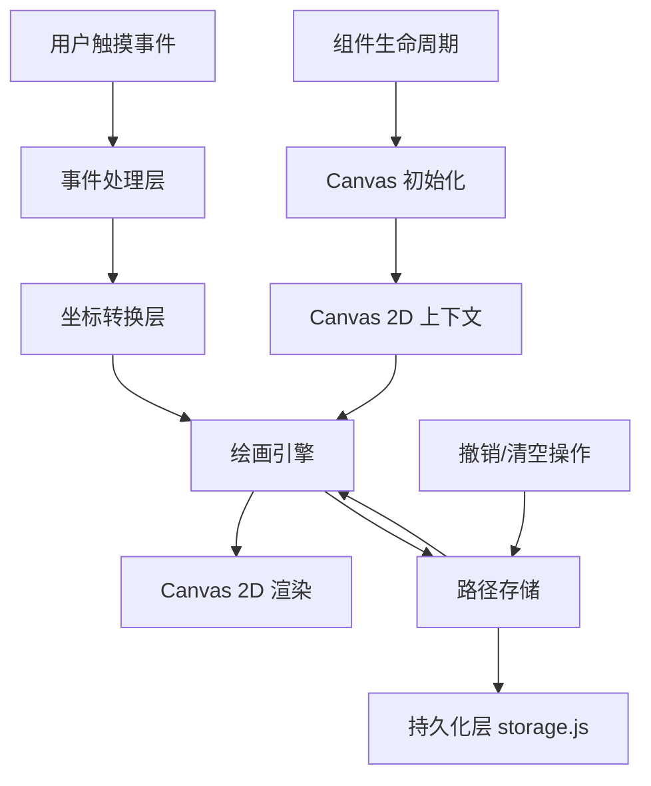
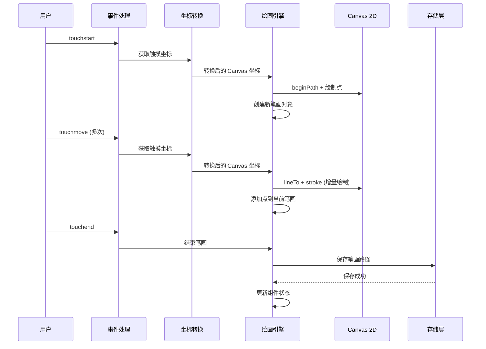

# 设计文档：草稿画板组件 Canvas 优化

## 概述

本设计文档针对微信小程序草稿画板组件 (draft-sheet) 的绘画功能进行全面优化。当前组件使用旧版 Canvas API (`wx.createCanvasContext`)，存在性能问题、坐标转换不准确、高 DPI 屏幕模糊等问题。本次优化将升级到 Canvas 2D API，重构触摸事件处理，实现高性能、流畅的手写绘画体验。

优化目标：
- 升级到微信小程序 Canvas 2D API，提升性能和兼容性
- 修复触摸坐标转换问题，确保绘画位置准确
- 支持高 DPI 屏幕，解决笔迹模糊问题
- 优化绘画算法，提升流畅度
- 保持现有 API 接口和存储机制不变

## 架构设计

### 整体架构



### 主要工作流程



## 组件和接口

### Canvas 管理器

**职责**：管理 Canvas 2D 上下文的初始化、像素比适配、坐标系统

**接口**：

```javascript
class CanvasManager {
  /**
   * 初始化 Canvas 2D 上下文
   * @param {Object} component - 组件实例
   * @param {string} canvasId - Canvas ID
   * @returns {Promise<boolean>} 是否初始化成功
   */
  async initialize(component, canvasId)
  
  /**
   * 获取 Canvas 2D 上下文
   * @returns {CanvasRenderingContext2D|null}
   */
  getContext()
  
  /**
   * 获取 Canvas 尺寸信息
   * @returns {Object} {width, height, dpr}
   */
  getCanvasSize()
  
  /**
   * 获取 Canvas 边界矩形
   * @returns {Object} {left, top, width, height}
   */
  getCanvasRect()
  
  /**
   * 清空 Canvas
   */
  clear()
  
  /**
   * 销毁资源
   */
  destroy()
}
```


### 坐标转换器

**职责**：将触摸事件坐标转换为 Canvas 坐标，处理像素比缩放

**接口**：

```javascript
class CoordinateTransformer {
  /**
   * 构造函数
   * @param {Object} canvasRect - Canvas 边界矩形
   * @param {number} dpr - 设备像素比
   */
  constructor(canvasRect, dpr)
  
  /**
   * 转换触摸坐标到 Canvas 坐标
   * @param {Object} touch - 触摸对象 {x, y, clientX, clientY, pageX, pageY}
   * @returns {Object|null} Canvas 坐标 {x, y} 或 null
   */
  transformToCanvasCoordinate(touch)
  
  /**
   * 提取触摸坐标值
   * @param {Object} touch - 触摸对象
   * @param {Array<string>} keys - 坐标键名优先级列表
   * @returns {number}
   */
  extractCoordinate(touch, keys)
}
```

### 绘画引擎

**职责**：管理绘画操作、笔画路径、渲染逻辑

**接口**：

```javascript
class DrawingEngine {
  /**
   * 构造函数
   * @param {CanvasRenderingContext2D} ctx - Canvas 2D 上下文
   * @param {Object} options - 绘画选项 {lineWidth, strokeColor}
   */
  constructor(ctx, options)
  
  /**
   * 开始新笔画
   * @param {Object} point - 起始点 {x, y}
   */
  beginStroke(point)
  
  /**
   * 添加点到当前笔画
   * @param {Object} point - 点坐标 {x, y}
   */
  addPoint(point)
  
  /**
   * 结束当前笔画
   * @returns {Object|null} 完成的笔画对象
   */
  endStroke()
  
  /**
   * 绘制完整路径（用于重绘）
   * @param {Object} path - 路径对象 {points, color, lineWidth}
   */
  drawPath(path)
  
  /**
   * 重绘所有路径
   * @param {Array<Object>} paths - 路径数组
   */
  redrawAll(paths)
  
  /**
   * 清空画布
   */
  clear()
}
```


## 数据模型

### 笔画路径对象

```javascript
interface StrokePath {
  // 笔画颜色
  color: string
  
  // 线条宽度（逻辑像素）
  lineWidth: number
  
  // 点坐标数组（Canvas 坐标系，已考虑 DPR）
  points: Array<{x: number, y: number}>
}
```

### Canvas 尺寸信息

```javascript
interface CanvasSize {
  // Canvas 逻辑宽度（rpx 转换后的 px）
  width: number
  
  // Canvas 逻辑高度（rpx 转换后的 px）
  height: number
  
  // 设备像素比
  dpr: number
}
```

### Canvas 边界矩形

```javascript
interface CanvasRect {
  // Canvas 左边界（相对于页面）
  left: number
  
  // Canvas 上边界（相对于页面）
  top: number
  
  // Canvas 宽度
  width: number
  
  // Canvas 高度
  height: number
}
```

### 草稿数据存储格式

```javascript
interface DraftData {
  // 场景标识
  sceneKey: string
  
  // 笔画路径数组
  paths: Array<StrokePath>
  
  // 最后更新时间戳
  updatedAt: number
}
```

## 关键函数的形式化规范

### 函数 1: initializeCanvas2D()

```javascript
async function initializeCanvas2D(component, canvasId, retryCount = 0)
```

**前置条件**：
- `component` 是有效的组件实例
- `canvasId` 是非空字符串
- `retryCount >= 0`
- 组件的 `internalVisible` 为 `true`（弹窗已打开）

**后置条件**：
- 返回 `{success: true, ctx, canvas, dpr, rect}` 当初始化成功
- 返回 `{success: false}` 当初始化失败或达到重试上限
- 如果成功，`ctx` 是有效的 Canvas 2D 上下文
- 如果成功，`canvas` 是有效的 Canvas 对象
- 如果成功，`dpr` 是正数（设备像素比）
- 如果成功，`rect` 包含有效的边界信息

**循环不变式**：N/A（使用异步重试机制，非循环）


### 函数 2: transformTouchToCanvasCoordinate()

```javascript
function transformTouchToCanvasCoordinate(touch, canvasRect, dpr)
```

**前置条件**：
- `touch` 是有效的触摸对象，包含坐标信息
- `canvasRect` 是有效的边界矩形对象
- `canvasRect.width > 0 && canvasRect.height > 0`
- `dpr > 0`（设备像素比）

**后置条件**：
- 返回 `{x, y}` 对象，其中 `0 <= x <= canvasRect.width * dpr` 且 `0 <= y <= canvasRect.height * dpr`
- 坐标已经过边界裁剪，不会超出 Canvas 范围
- 坐标已乘以 `dpr`，适配高 DPI 屏幕
- 如果输入无效，返回 `null`

**循环不变式**：N/A（无循环）

### 函数 3: drawSmoothLine()

```javascript
function drawSmoothLine(ctx, fromPoint, toPoint, style)
```

**前置条件**：
- `ctx` 是有效的 Canvas 2D 上下文
- `fromPoint` 和 `toPoint` 是有效的点对象 `{x, y}`
- `style` 包含 `{color, lineWidth}` 属性
- `style.lineWidth > 0`

**后置条件**：
- 在 Canvas 上绘制从 `fromPoint` 到 `toPoint` 的线段
- 线段使用指定的颜色和宽度
- 线段端点为圆形（`lineCap = 'round'`）
- 线段连接处为圆形（`lineJoin = 'round'`）
- Canvas 状态已更新，线段已渲染

**循环不变式**：N/A（无循环）

### 函数 4: redrawAllPaths()

```javascript
function redrawAllPaths(ctx, paths, canvasSize)
```

**前置条件**：
- `ctx` 是有效的 Canvas 2D 上下文
- `paths` 是笔画路径数组
- `canvasSize` 包含 `{width, height, dpr}` 属性
- `canvasSize.width > 0 && canvasSize.height > 0`
- `canvasSize.dpr > 0`

**后置条件**：
- Canvas 已清空
- 所有 `paths` 中的路径已按顺序重绘
- 每个路径的所有点已连接成线段
- 单点路径绘制为圆点
- Canvas 状态已更新

**循环不变式**：
- 对于外层循环（遍历 paths）：已处理的路径都已正确绘制到 Canvas
- 对于内层循环（遍历 points）：已处理的点都已连接成线段


## 算法伪代码

### Canvas 2D 初始化算法

```javascript
ALGORITHM initializeCanvas2D(component, canvasId, retryCount)
INPUT: component (组件实例), canvasId (字符串), retryCount (整数, 默认 0)
OUTPUT: result (对象) {success: boolean, ctx?, canvas?, dpr?, rect?}

BEGIN
  // 前置条件检查
  ASSERT component !== null AND component !== undefined
  ASSERT canvasId !== '' AND typeof canvasId === 'string'
  ASSERT retryCount >= 0
  ASSERT component.data.internalVisible === true
  
  // 步骤 1: 查询 Canvas 节点
  query ← wx.createSelectorQuery().in(component)
  query.select('#' + canvasId).node().boundingClientRect()
  
  results ← AWAIT query.exec()
  
  // 检查组件是否仍然可见
  IF component.data.internalVisible === false THEN
    RETURN {success: false}
  END IF
  
  // 步骤 2: 验证查询结果
  nodeResult ← results[0]
  rectResult ← results[1]
  
  isValid ← (nodeResult !== null AND nodeResult.node !== null AND
             rectResult !== null AND rectResult.width > 0 AND rectResult.height > 0)
  
  // 步骤 3: 重试逻辑
  IF NOT isValid THEN
    IF retryCount >= CANVAS_PREPARE_RETRY_LIMIT THEN
      RETURN {success: false}
    END IF
    
    AWAIT sleep(CANVAS_PREPARE_RETRY_DELAY)
    RETURN initializeCanvas2D(component, canvasId, retryCount + 1)
  END IF
  
  // 步骤 4: 获取 Canvas 对象和上下文
  canvas ← nodeResult.node
  ctx ← canvas.getContext('2d')
  dpr ← wx.getSystemInfoSync().pixelRatio OR 1
  
  // 步骤 5: 设置 Canvas 物理尺寸（考虑 DPR）
  canvas.width ← rectResult.width * dpr
  canvas.height ← rectResult.height * dpr
  
  // 步骤 6: 缩放上下文以适配 DPR
  ctx.scale(dpr, dpr)
  
  // 步骤 7: 构建边界矩形
  rect ← {
    left: rectResult.left OR 0,
    top: rectResult.top OR 0,
    width: rectResult.width,
    height: rectResult.height
  }
  
  // 后置条件验证
  ASSERT ctx !== null
  ASSERT canvas !== null
  ASSERT dpr > 0
  ASSERT rect.width > 0 AND rect.height > 0
  
  RETURN {success: true, ctx, canvas, dpr, rect}
END
```

**前置条件**：
- component 是有效的组件实例
- canvasId 是非空字符串
- retryCount >= 0
- 组件的弹窗已打开

**后置条件**：
- 成功时返回包含 Canvas 2D 上下文、Canvas 对象、DPR、边界矩形的对象
- 失败时返回 {success: false}
- Canvas 物理尺寸已根据 DPR 调整
- Canvas 上下文已缩放以适配 DPR

**循环不变式**：N/A（使用递归重试）


### 坐标转换算法

```javascript
ALGORITHM transformTouchToCanvasCoordinate(touch, canvasRect, dpr)
INPUT: touch (触摸对象), canvasRect (边界矩形), dpr (设备像素比)
OUTPUT: point (Canvas 坐标对象 {x, y}) OR null

BEGIN
  // 前置条件检查
  ASSERT touch !== null AND touch !== undefined
  ASSERT canvasRect !== null
  ASSERT canvasRect.width > 0 AND canvasRect.height > 0
  ASSERT dpr > 0
  
  // 步骤 1: 提取触摸坐标（优先级：x > clientX > pageX）
  touchX ← extractCoordinate(touch, ['x', 'clientX', 'pageX'])
  touchY ← extractCoordinate(touch, ['y', 'clientY', 'pageY'])
  
  // 步骤 2: 转换为相对于 Canvas 的坐标
  relativeX ← touchX - canvasRect.left
  relativeY ← touchY - canvasRect.top
  
  // 步骤 3: 边界裁剪（确保坐标在 Canvas 范围内）
  clampedX ← MAX(0, MIN(relativeX, canvasRect.width))
  clampedY ← MAX(0, MIN(relativeY, canvasRect.height))
  
  // 步骤 4: 返回坐标（不乘以 DPR，因为 ctx.scale 已处理）
  point ← {x: clampedX, y: clampedY}
  
  // 后置条件验证
  ASSERT 0 <= point.x <= canvasRect.width
  ASSERT 0 <= point.y <= canvasRect.height
  
  RETURN point
END

FUNCTION extractCoordinate(touch, keys)
INPUT: touch (对象), keys (字符串数组)
OUTPUT: value (数字)

BEGIN
  FOR each key IN keys DO
    value ← touch[key]
    IF typeof value === 'number' THEN
      RETURN value
    END IF
  END FOR
  
  RETURN 0
END
```

**前置条件**：
- touch 是有效的触摸对象
- canvasRect 包含有效的边界信息
- dpr 是正数

**后置条件**：
- 返回的坐标在 Canvas 范围内
- 坐标已经过边界裁剪
- 坐标为逻辑像素（ctx.scale 已处理 DPR）

**循环不变式**：
- extractCoordinate 循环：已检查的键都不包含有效数字值


### 绘画算法

```javascript
ALGORITHM handleTouchStart(event)
INPUT: event (触摸事件对象)
OUTPUT: void (副作用：开始新笔画)

BEGIN
  // 步骤 1: 提取触摸点
  sourceTouch ← event.touches[0] OR event.changedTouches[0]
  IF sourceTouch === null THEN
    RETURN
  END IF
  
  // 步骤 2: 标记绘画状态
  this.isDrawing ← true
  
  // 步骤 3: 确保 Canvas 已准备好
  isReady ← AWAIT this.ensureCanvasReady()
  IF NOT isReady OR NOT this.isDrawing THEN
    RETURN
  END IF
  
  // 步骤 4: 转换坐标
  point ← transformTouchToCanvasCoordinate(sourceTouch, this.canvasRect, this.dpr)
  IF point === null THEN
    RETURN
  END IF
  
  // 步骤 5: 创建新笔画对象
  this.currentStroke ← {
    color: DEFAULT_STROKE_COLOR,
    lineWidth: DEFAULT_LINE_WIDTH,
    points: [point]
  }
  
  // 步骤 6: 绘制起始点
  drawPoint(this.ctx, point, this.currentStroke)
  
  // 步骤 7: 隐藏占位符
  IF this.data.showPlaceholder === true THEN
    this.setData({showPlaceholder: false})
  END IF
END

ALGORITHM handleTouchMove(event)
INPUT: event (触摸事件对象)
OUTPUT: void (副作用：绘制线段)

BEGIN
  // 前置条件检查
  IF NOT this.isDrawing OR this.currentStroke === null THEN
    RETURN
  END IF
  
  // 步骤 1: 提取触摸点
  sourceTouch ← event.touches[0]
  IF sourceTouch === null THEN
    RETURN
  END IF
  
  // 步骤 2: 转换坐标
  point ← transformTouchToCanvasCoordinate(sourceTouch, this.canvasRect, this.dpr)
  IF point === null THEN
    RETURN
  END IF
  
  // 步骤 3: 获取上一个点
  points ← this.currentStroke.points
  lastPoint ← points[points.length - 1]
  
  // 步骤 4: 添加新点到笔画
  points.push(point)
  
  // 步骤 5: 绘制线段
  drawLine(this.ctx, lastPoint, point, this.currentStroke)
END

ALGORITHM handleTouchEnd(event)
INPUT: event (触摸事件对象)
OUTPUT: void (副作用：完成笔画并保存)

BEGIN
  // 步骤 1: 标记绘画结束
  this.isDrawing ← false
  
  // 步骤 2: 检查是否有当前笔画
  IF this.currentStroke === null OR this.currentStroke.points.length === 0 THEN
    RETURN
  END IF
  
  // 步骤 3: 保存笔画到路径数组
  this.paths.push({
    color: this.currentStroke.color,
    lineWidth: this.currentStroke.lineWidth,
    points: clone(this.currentStroke.points)
  })
  
  // 步骤 4: 清空当前笔画
  this.currentStroke ← null
  
  // 步骤 5: 持久化到存储
  persistDraft(this.data.sceneKey, this.paths)
  
  // 步骤 6: 更新组件状态
  this.setData({
    hasContent: true,
    canUndo: true,
    showPlaceholder: false,
    saveHintText: formatSavedHint(Date.now())
  })
  
  // 步骤 7: 触发变更事件
  this.triggerEvent('change', {
    sceneKey: this.data.sceneKey,
    hasContent: true,
    strokeCount: this.paths.length
  })
END
```


### 重绘算法

```javascript
ALGORITHM redrawAllPaths(ctx, paths, canvasSize)
INPUT: ctx (Canvas 2D 上下文), paths (笔画数组), canvasSize (尺寸对象)
OUTPUT: void (副作用：重绘所有路径)

BEGIN
  // 前置条件检查
  ASSERT ctx !== null
  ASSERT Array.isArray(paths)
  ASSERT canvasSize.width > 0 AND canvasSize.height > 0
  
  // 步骤 1: 清空 Canvas
  ctx.clearRect(0, 0, canvasSize.width, canvasSize.height)
  
  // 步骤 2: 遍历所有路径
  FOR each path IN paths DO
    // 循环不变式：已处理的路径都已正确绘制
    ASSERT allPreviousPathsDrawn(paths, currentIndex)
    
    points ← path.points
    
    // 跳过空路径
    IF points.length === 0 THEN
      CONTINUE
    END IF
    
    // 单点路径：绘制圆点
    IF points.length === 1 THEN
      drawPoint(ctx, points[0], path)
      CONTINUE
    END IF
    
    // 多点路径：绘制线段
    FOR i FROM 1 TO points.length - 1 DO
      // 循环不变式：已处理的点都已连接成线段
      ASSERT allPreviousSegmentsDrawn(points, i)
      
      fromPoint ← points[i - 1]
      toPoint ← points[i]
      drawLine(ctx, fromPoint, toPoint, path)
    END FOR
  END FOR
  
  // 后置条件验证
  ASSERT allPathsDrawn(paths)
END

FUNCTION drawLine(ctx, fromPoint, toPoint, style)
INPUT: ctx (Canvas 2D 上下文), fromPoint (起点), toPoint (终点), style (样式)
OUTPUT: void (副作用：绘制线段)

BEGIN
  ASSERT ctx !== null
  ASSERT fromPoint !== null AND toPoint !== null
  ASSERT style.lineWidth > 0
  
  ctx.beginPath()
  ctx.strokeStyle ← style.color OR DEFAULT_STROKE_COLOR
  ctx.lineWidth ← style.lineWidth OR DEFAULT_LINE_WIDTH
  ctx.lineCap ← 'round'
  ctx.lineJoin ← 'round'
  ctx.moveTo(fromPoint.x, fromPoint.y)
  ctx.lineTo(toPoint.x, toPoint.y)
  ctx.stroke()
END

FUNCTION drawPoint(ctx, point, style)
INPUT: ctx (Canvas 2D 上下文), point (点坐标), style (样式)
OUTPUT: void (副作用：绘制圆点)

BEGIN
  ASSERT ctx !== null
  ASSERT point !== null
  ASSERT style.lineWidth > 0
  
  radius ← (style.lineWidth OR DEFAULT_LINE_WIDTH) / 2
  
  ctx.beginPath()
  ctx.fillStyle ← style.color OR DEFAULT_STROKE_COLOR
  ctx.arc(point.x, point.y, radius, 0, Math.PI * 2)
  ctx.fill()
END
```

**前置条件**：
- ctx 是有效的 Canvas 2D 上下文
- paths 是笔画路径数组
- canvasSize 包含有效的尺寸信息

**后置条件**：
- Canvas 已清空并重绘所有路径
- 每个路径的所有点已连接成线段
- 单点路径绘制为圆点

**循环不变式**：
- 外层循环：已处理的路径都已正确绘制到 Canvas
- 内层循环：已处理的点都已连接成线段


## 示例用法

### Canvas 2D 初始化示例

```javascript
// 在组件的 handleOpen 方法中初始化 Canvas
async handleOpen() {
  if (!this.data.sceneKey || this.data.internalVisible) {
    return
  }
  
  this.setData({ internalVisible: true }, async () => {
    // 等待 DOM 更新
    await new Promise(resolve => wx.nextTick(resolve))
    
    // 初始化 Canvas 2D
    const result = await this.initializeCanvas2D(this, 'draft-canvas')
    
    if (result.success) {
      this.ctx = result.ctx
      this.canvas = result.canvas
      this.dpr = result.dpr
      this.canvasRect = result.rect
      this.canvasSize = {
        width: result.rect.width,
        height: result.rect.height,
        dpr: result.dpr
      }
      
      // 重绘已保存的路径
      this.redrawAllPaths(this.ctx, this.paths, this.canvasSize)
    }
  })
}
```

### 触摸事件处理示例

```javascript
// 触摸开始
handleTouchStart(e) {
  const touch = e.touches?.[0] || e.changedTouches?.[0]
  if (!touch) return
  
  this.isDrawing = true
  
  this.ensureCanvasReady().then(isReady => {
    if (!isReady || !this.isDrawing) return
    
    const point = this.transformTouchToCanvasCoordinate(
      touch, 
      this.canvasRect, 
      this.dpr
    )
    
    if (point) {
      this.currentStroke = {
        color: '#FF7D00',
        lineWidth: 4,
        points: [point]
      }
      
      this.drawPoint(this.ctx, point, this.currentStroke)
      
      if (this.data.showPlaceholder) {
        this.setData({ showPlaceholder: false })
      }
    }
  })
}

// 触摸移动
handleTouchMove(e) {
  if (!this.isDrawing || !this.currentStroke) return
  
  const touch = e.touches?.[0]
  if (!touch) return
  
  const point = this.transformTouchToCanvasCoordinate(
    touch, 
    this.canvasRect, 
    this.dpr
  )
  
  if (point) {
    const points = this.currentStroke.points
    const lastPoint = points[points.length - 1]
    
    points.push(point)
    this.drawLine(this.ctx, lastPoint, point, this.currentStroke)
  }
}

// 触摸结束
handleTouchEnd(e) {
  this.isDrawing = false
  
  if (!this.currentStroke || this.currentStroke.points.length === 0) {
    return
  }
  
  // 保存笔画
  this.paths.push({
    color: this.currentStroke.color,
    lineWidth: this.currentStroke.lineWidth,
    points: [...this.currentStroke.points]
  })
  
  this.currentStroke = null
  
  // 持久化
  this.persistDraft()
  
  // 更新状态
  this.setData({
    hasContent: true,
    canUndo: true,
    showPlaceholder: false,
    saveHintText: this.formatSavedHint(Date.now())
  })
}
```


### 撤销和清空示例

```javascript
// 撤销最后一笔
handleUndo() {
  if (this.paths.length === 0) return
  
  this.paths.pop()
  this.redrawAllPaths(this.ctx, this.paths, this.canvasSize)
  this.persistDraft()
  
  this.setData({
    hasContent: this.paths.length > 0,
    canUndo: this.paths.length > 0,
    showPlaceholder: this.paths.length === 0,
    saveHintText: this.formatSavedHint(Date.now())
  })
}

// 清空画布
handleClear() {
  if (this.paths.length === 0) return
  
  wx.showModal({
    title: '清空草稿纸',
    content: '当前草稿会被清空，确定继续吗？',
    confirmText: '清空',
    cancelText: '保留',
    success: (res) => {
      if (!res.confirm) return
      
      this.paths = []
      this.currentStroke = null
      
      // 清空 Canvas
      this.ctx.clearRect(0, 0, this.canvasSize.width, this.canvasSize.height)
      
      // 清空存储
      storage.clearDraftSheet(this.data.sceneKey)
      
      // 更新状态
      this.setData({
        hasContent: false,
        canUndo: false,
        showPlaceholder: true,
        saveHintText: '切题和收起都不会丢失'
      })
    }
  })
}
```

## 正确性属性

*属性是一个特征或行为，应该在系统的所有有效执行中保持为真——本质上是关于系统应该做什么的形式化陈述。属性是人类可读规范和机器可验证正确性保证之间的桥梁。*

### 属性 1: Canvas 初始化正确性

对于任何有效的组件实例和 Canvas ID，如果组件弹窗已打开且初始化成功，则 Canvas 2D 上下文、Canvas 对象、设备像素比都有效，且 Canvas 物理尺寸已根据 DPR 正确设置。

**验证需求**: 需求 2.1, 2.4, 3.1, 3.2, 3.3

### 属性 2: 坐标转换边界安全性

对于任何触摸事件和有效的 Canvas 边界，转换后的坐标要么为 null（无效输入），要么在 Canvas 范围内，不会超出边界。

**验证需求**: 需求 4.3, 4.4, 4.5

### 属性 3: 笔画完整性

对于任何保存的笔画，必须至少包含一个点，具有有效的颜色和线宽，且所有点的坐标非负。

**验证需求**: 需求 5.1, 5.2, 5.3, 5.4, 7.2


### 属性 4: 重绘幂等性

对于任何相同的路径数组和 Canvas 状态，多次调用重绘函数应产生相同的视觉结果（幂等性）。

**验证需求**: 需求 8.2, 8.3, 8.7

### 属性 5: 持久化往返一致性

对于任何有效的场景键和路径数组，保存后重新加载的路径应与原始路径完全一致（深度相等）。这是一个往返属性，确保序列化和反序列化的正确性。

**验证需求**: 需求 7.4, 8.1, 11.2, 11.3

### 属性 6: 撤销操作正确性

对于任何非空路径数组，执行撤销操作后，路径数量应减少 1，且剩余路径应保持不变。

**验证需求**: 需求 9.1, 9.2

### 属性 7: DPR 适配正确性

对于任何有效的 DPR 和逻辑尺寸，Canvas 物理尺寸应为逻辑尺寸乘以 DPR，样式尺寸应为逻辑尺寸，以确保高清显示。

**验证需求**: 需求 3.2, 3.3, 3.5

### 属性 8: 场景数据隔离

对于任何两个不同的场景键，它们的草稿数据应完全隔离，一个场景的操作不应影响另一个场景的数据。

**验证需求**: 需求 11.2, 11.3, 11.4, 11.5

### 属性 9: 清空操作完整性

对于任何场景，执行清空操作后，路径数组应为空，Canvas 应被清空，对应场景的持久化数据应被删除。

**验证需求**: 需求 10.2, 10.3, 10.4

### 属性 10: 绘画状态一致性

对于任何绘画会话，当绘画状态为 false 时，所有触摸事件应被忽略，当前绘画状态应保持不变。

**验证需求**: 需求 6.7, 13.2, 13.3, 15.2

### 属性 11: 错误恢复能力

对于任何触摸坐标无效或存储失败的情况，系统应优雅处理错误，保持绘画功能可用，并在条件恢复后继续正常工作。

**验证需求**: 需求 12.1, 12.2, 13.2, 13.4, 14.1, 14.3, 14.5

### 属性 12: UI 状态同步

对于任何路径数组状态变化（添加、删除、清空），组件的 UI 状态（hasContent、canUndo、showPlaceholder）应与路径数组状态保持同步。

**验证需求**: 需求 7.5, 7.6, 9.4, 9.5, 9.6, 10.5, 10.6, 10.7, 20.1, 20.2, 20.4, 20.5

### 属性 13: 笔画绘制连续性

对于任何有效的触摸移动序列，每个新点应与前一个点连接成线段，使用当前笔画的颜色和线宽。

**验证需求**: 需求 6.2, 6.3, 6.4

### 属性 14: 资源清理完整性

对于任何组件销毁事件，所有 Canvas 资源、路径数组和当前笔画引用应被完全清理。

**验证需求**: 需求 18.3, 18.4

## 错误处理

### 错误场景 1: Canvas 初始化失败

**条件**：Canvas 节点查询失败或达到重试上限

**响应**：
- 返回 `{success: false}`
- 不抛出异常，优雅降级
- 记录警告日志（如果有日志系统）

**恢复**：
- 用户可以关闭弹窗后重新打开，触发重新初始化
- 组件保持可用状态，不会崩溃


### 错误场景 2: 触摸坐标无效

**条件**：触摸事件对象不包含有效坐标信息

**响应**：
- `transformTouchToCanvasCoordinate` 返回 `null`
- 忽略该触摸事件，不进行绘画
- 不影响已有的绘画状态

**恢复**：
- 等待下一个有效的触摸事件
- 用户可以继续正常绘画

### 错误场景 3: Canvas 上下文丢失

**条件**：在绘画过程中 Canvas 上下文变为 null（如组件被销毁）

**响应**：
- 在每个绘画操作前检查 `ctx !== null`
- 如果上下文无效，提前返回，不执行绘画
- 保护已保存的路径数据不丢失

**恢复**：
- 重新打开组件时重新初始化 Canvas
- 从存储中恢复路径数据并重绘

### 错误场景 4: 存储操作失败

**条件**：`wx.setStorageSync` 抛出异常（如存储空间不足）

**响应**：
- 使用 try-catch 捕获异常
- 显示提示信息："草稿保存失败，请清理存储空间"
- 绘画功能继续可用，但不持久化

**恢复**：
- 用户清理存储空间后，下次绘画会重新尝试保存
- 当前会话的绘画内容仍保留在内存中

### 错误场景 5: 组件在绘画过程中关闭

**条件**：用户在 `touchstart` 后、`touchend` 前关闭弹窗

**响应**：
- 在 `closePanel` 方法中设置 `this.isDrawing = false`
- 在 `handleTouchMove` 和 `handleTouchEnd` 中检查 `this.isDrawing`
- 丢弃未完成的笔画，不保存到路径数组

**恢复**：
- 已完成的笔画已保存，不受影响
- 重新打开时恢复已保存的内容

## 测试策略

### 单元测试方法

**测试目标**：验证各个函数的正确性和边界条件处理

**关键测试用例**：

1. **Canvas 初始化测试**
   - 测试成功初始化场景
   - 测试组件未打开时的失败场景
   - 测试重试机制
   - 测试 DPR 设置正确性

2. **坐标转换测试**
   - 测试正常坐标转换
   - 测试边界裁剪（负数、超出范围）
   - 测试不同坐标键的优先级（x, clientX, pageX）
   - 测试无效输入返回 null

3. **绘画逻辑测试**
   - 测试单点绘制
   - 测试多点连线
   - 测试笔画保存
   - 测试撤销操作
   - 测试清空操作

4. **持久化测试**
   - 测试保存和加载一致性
   - 测试多场景隔离
   - 测试清空操作


### 属性测试方法

**测试目标**：使用属性测试验证通用正确性属性

**属性测试库**：推荐使用 fast-check（JavaScript 属性测试库）

**关键属性测试**：

1. **坐标转换边界安全性**
   ```javascript
   fc.assert(
     fc.property(
       fc.record({
         x: fc.float(),
         y: fc.float(),
         clientX: fc.float(),
         clientY: fc.float()
       }),
       fc.record({
         left: fc.nat(1000),
         top: fc.nat(1000),
         width: fc.integer(100, 1000),
         height: fc.integer(100, 1000)
       }),
       fc.float(1, 3),
       (touch, rect, dpr) => {
         const point = transformTouchToCanvasCoordinate(touch, rect, dpr)
         return point === null || 
                (point.x >= 0 && point.x <= rect.width &&
                 point.y >= 0 && point.y <= rect.height)
       }
     )
   )
   ```

2. **重绘幂等性**
   ```javascript
   fc.assert(
     fc.property(
       fc.array(fc.record({
         color: fc.hexaString(6, 6).map(s => '#' + s),
         lineWidth: fc.integer(1, 10),
         points: fc.array(fc.record({
           x: fc.nat(500),
           y: fc.nat(500)
         }), 1, 20)
       })),
       (paths) => {
         const canvas1 = createMockCanvas()
         const canvas2 = createMockCanvas()
         
         redrawAllPaths(canvas1.ctx, paths, {width: 500, height: 500})
         const state1 = canvas1.getImageData()
         
         redrawAllPaths(canvas2.ctx, paths, {width: 500, height: 500})
         const state2 = canvas2.getImageData()
         
         return deepEqual(state1, state2)
       }
     )
   )
   ```

3. **笔画完整性**
   ```javascript
   fc.assert(
     fc.property(
       fc.array(fc.record({
         color: fc.hexaString(6, 6).map(s => '#' + s),
         lineWidth: fc.integer(1, 10),
         points: fc.array(fc.record({
           x: fc.nat(500),
           y: fc.nat(500)
         }), 1, 20)
       })),
       (paths) => {
         return paths.every(stroke => 
           stroke.points.length >= 1 &&
           stroke.color !== '' &&
           stroke.lineWidth > 0 &&
           stroke.points.every(p => p.x >= 0 && p.y >= 0)
         )
       }
     )
   )
   ```

### 集成测试方法

**测试目标**：验证组件在真实小程序环境中的完整工作流程

**测试场景**：

1. **完整绘画流程**
   - 打开草稿画板
   - 绘制多笔
   - 关闭画板
   - 重新打开验证内容保留

2. **多场景隔离**
   - 在不同题目中打开草稿画板
   - 验证每个场景的草稿独立保存
   - 验证切换场景后内容正确

3. **撤销和清空**
   - 绘制多笔后撤销
   - 验证撤销后状态正确
   - 清空后验证存储已清除

4. **高 DPI 屏幕测试**
   - 在不同 DPR 设备上测试（1x, 2x, 3x）
   - 验证笔迹清晰度
   - 验证坐标准确性


## 性能考虑

### 性能优化策略

1. **Canvas 2D API 优势**
   - 使用原生 Canvas 2D API，性能优于旧版 `wx.createCanvasContext`
   - 支持硬件加速，绘制更流畅
   - 减少不必要的 `draw()` 调用开销

2. **增量绘制**
   - `touchmove` 事件中只绘制新增线段，不重绘整个画布
   - 使用 `beginPath()` 和 `stroke()` 直接绘制，无需 `draw(true)`
   - 减少绘制延迟，提升响应速度

3. **坐标计算优化**
   - 预先计算并缓存 Canvas 边界矩形
   - 避免在每次触摸事件中重复查询 DOM
   - 使用简单的数学运算，避免复杂计算

4. **内存管理**
   - 限制路径数组大小（如最多保存 100 笔）
   - 及时清理不再使用的笔画对象
   - 使用浅拷贝优化点坐标存储

5. **事件节流**
   - 如果 `touchmove` 事件过于频繁，可考虑节流（如每 16ms 处理一次）
   - 平衡流畅度和性能

### 性能指标

**目标性能指标**：

- Canvas 初始化时间：< 200ms
- 触摸响应延迟：< 16ms（60 FPS）
- 单笔绘制时间：< 50ms
- 重绘 50 笔路径时间：< 100ms
- 内存占用：< 5MB（包含路径数据）

**性能监控**：

```javascript
// Canvas 初始化性能监控
const startTime = Date.now()
const result = await initializeCanvas2D(this, 'draft-canvas')
const duration = Date.now() - startTime
console.log(`Canvas 初始化耗时: ${duration}ms`)

// 绘制性能监控
const drawStartTime = performance.now()
redrawAllPaths(ctx, paths, canvasSize)
const drawDuration = performance.now() - drawStartTime
console.log(`重绘 ${paths.length} 笔耗时: ${drawDuration.toFixed(2)}ms`)
```

## 安全考虑

### 安全策略

1. **输入验证**
   - 验证触摸坐标范围，防止越界
   - 验证路径数据结构，防止恶意数据
   - 限制路径数组大小，防止内存溢出

2. **存储安全**
   - 使用 `sceneKey` 隔离不同场景的数据
   - 验证 `sceneKey` 格式，防止注入攻击
   - 限制单个草稿的存储大小

3. **资源保护**
   - 限制 Canvas 尺寸，防止过大占用内存
   - 限制笔画数量，防止无限增长
   - 及时释放不再使用的资源

4. **错误隔离**
   - 使用 try-catch 捕获存储异常
   - 防止单个错误导致整个组件崩溃
   - 提供友好的错误提示

### 安全检查清单

- ✅ 坐标边界检查
- ✅ 路径数据验证
- ✅ 存储大小限制
- ✅ 异常捕获和处理
- ✅ 资源及时释放
- ✅ 场景数据隔离


## 依赖项

### 微信小程序 API

- `wx.createSelectorQuery()` - 查询 Canvas 节点和边界
- `wx.getSystemInfoSync()` - 获取设备像素比
- `wx.setStorageSync()` / `wx.getStorageSync()` - 本地存储
- `wx.showModal()` - 清空确认对话框
- `wx.nextTick()` - DOM 更新后回调

### 组件依赖

- `tdesign-miniprogram/icon/icon` - 图标组件
- `tdesign-miniprogram/popup/popup` - 弹窗组件

### 工具模块

- `utils/storage.js` - 存储管理工具
  - `storage.setDraftSheet(sceneKey, data)` - 保存草稿
  - `storage.getDraftSheet(sceneKey)` - 加载草稿
  - `storage.clearDraftSheet(sceneKey)` - 清空草稿

### Canvas 2D API

- `canvas.getContext('2d')` - 获取 2D 上下文
- `ctx.scale(dpr, dpr)` - 缩放上下文以适配 DPR
- `ctx.clearRect(x, y, width, height)` - 清空矩形区域
- `ctx.beginPath()` - 开始新路径
- `ctx.moveTo(x, y)` - 移动到起点
- `ctx.lineTo(x, y)` - 绘制线段
- `ctx.arc(x, y, radius, startAngle, endAngle)` - 绘制圆弧
- `ctx.stroke()` - 描边路径
- `ctx.fill()` - 填充路径
- `ctx.strokeStyle` - 设置描边颜色
- `ctx.fillStyle` - 设置填充颜色
- `ctx.lineWidth` - 设置线宽
- `ctx.lineCap` - 设置线条端点样式
- `ctx.lineJoin` - 设置线条连接样式

### 浏览器 API

- `Date.now()` - 获取当前时间戳
- `performance.now()` - 高精度时间戳（性能监控）
- `setTimeout()` / `clearTimeout()` - 定时器
- `Promise` - 异步操作

### 数据结构

- `Array` - 路径和点坐标数组
- `Object` - 笔画、坐标、配置对象
- `JSON.parse()` / `JSON.stringify()` - 数据序列化

## 实现注意事项

### Canvas 2D 迁移要点

1. **WXML 模板修改**
   ```xml
   <!-- 旧版 -->
   <canvas canvas-id="draft-canvas" class="draft-sheet__canvas"></canvas>
   
   <!-- 新版 Canvas 2D -->
   <canvas type="2d" id="draft-canvas" class="draft-sheet__canvas"></canvas>
   ```

2. **上下文获取方式**
   ```javascript
   // 旧版
   const ctx = wx.createCanvasContext('draft-canvas', this)
   
   // 新版 Canvas 2D
   const query = wx.createSelectorQuery().in(this)
   query.select('#draft-canvas').node().exec(res => {
     const canvas = res[0].node
     const ctx = canvas.getContext('2d')
   })
   ```

3. **绘制方式差异**
   ```javascript
   // 旧版：需要调用 draw()
   ctx.stroke()
   ctx.draw(true) // 保留之前的内容
   
   // 新版 Canvas 2D：直接生效
   ctx.stroke() // 立即渲染，无需 draw()
   ```

4. **DPR 适配**
   ```javascript
   // 新版需要手动设置物理尺寸和缩放
   const dpr = wx.getSystemInfoSync().pixelRatio || 1
   canvas.width = logicalWidth * dpr
   canvas.height = logicalHeight * dpr
   ctx.scale(dpr, dpr)
   ```

### 兼容性说明

- Canvas 2D API 要求微信小程序基础库版本 >= 2.9.0
- 建议在 `app.json` 中设置 `"lazyCodeLoading": "requiredComponents"`
- 如需支持更低版本，可保留旧版 API 作为降级方案

### 调试技巧

1. **Canvas 可视化调试**
   - 在开发者工具中启用 Canvas 调试模式
   - 使用 `console.log` 输出坐标和路径信息
   - 绘制辅助网格验证坐标系统

2. **性能分析**
   - 使用 `performance.now()` 测量关键操作耗时
   - 监控 `touchmove` 事件频率
   - 检查内存占用情况

3. **真机测试**
   - 在不同 DPR 设备上测试（iPhone、Android）
   - 验证触摸坐标准确性
   - 检查笔迹清晰度

## 总结

本设计文档提供了草稿画板组件 Canvas 优化的完整技术方案，包括：

- 从旧版 Canvas API 升级到 Canvas 2D API
- 完整的坐标转换和 DPR 适配方案
- 优化的绘画算法和事件处理流程
- 形式化的函数规范和正确性属性
- 详细的错误处理和性能优化策略
- 完整的测试策略和实现注意事项

通过本次优化，草稿画板组件将获得：
- ✅ 更好的性能和流畅度
- ✅ 准确的触摸坐标转换
- ✅ 高 DPI 屏幕下的清晰笔迹
- ✅ 稳定可靠的绘画体验
- ✅ 完善的错误处理机制

实现时应严格遵循本设计文档的规范，确保每个函数满足前置条件、后置条件和循环不变式，以保证系统的正确性和可靠性。
