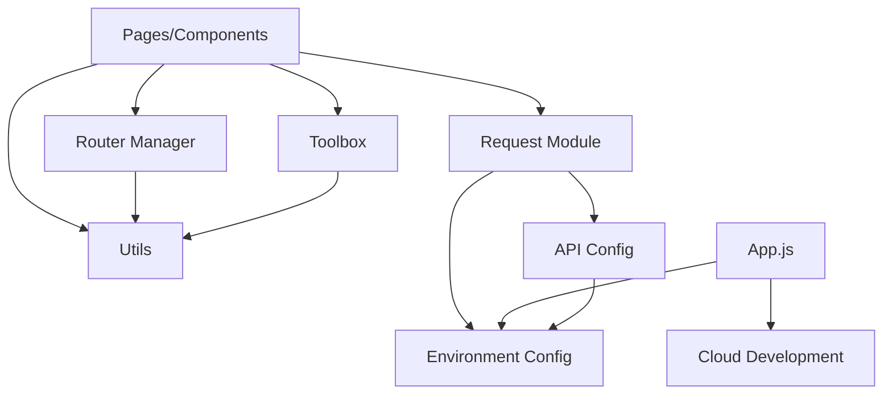
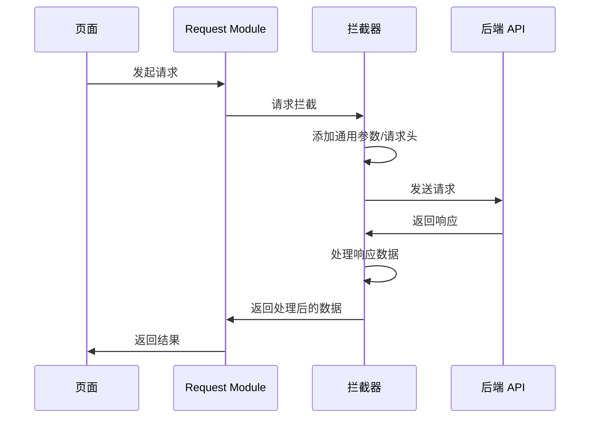

# 设计文档

## 概述

template-base 是一个现代化的微信小程序基座模板，它整合了 template-init 的丰富功能和 template-skyline 的 Skyline 渲染引擎优势，采用模块化的文件组织架构，为开发者提供开箱即用的开发基础设施。

### 核心特性

1. **Skyline 渲染引擎**: 使用微信最新的 Skyline 渲染引擎，提供更好的性能和现代化的开发体验
2. **模块化架构**: 清晰的目录结构（router、config、interface、utils、toolbox），便于代码组织和维护
3. **统一路由管理**: 集中式路由配置和跳转封装，避免硬编码路径
4. **网络请求封装**: 统一的 HTTP 请求处理，支持拦截器和错误处理
5. **环境配置管理**: 支持开发/生产环境切换，便于多环境部署
6. **工具函数库**: 提供常用的工具函数，提高开发效率
7. **云开发支持**: 可选的云开发能力，按需启用
8. **组件库准备**: 为 TDesign 组件库集成预留配置空间

### 设计目标

- **简洁实用**: 清理不必要的示例代码，保留实用的功能封装
- **易于扩展**: 模块化设计，便于添加新功能
- **开发友好**: 提供完整的注释和文档，降低学习成本
- **性能优先**: 使用 Skyline 渲染引擎和按需加载，优化性能

## 架构

### 整体架构

```
┌─────────────────────────────────────────────────────────┐
│                      小程序应用层                          │
│                    (Pages & Components)                  │
└─────────────────────────────────────────────────────────┘
                            │
                            ↓
┌─────────────────────────────────────────────────────────┐
│                      业务逻辑层                           │
│  ┌──────────┐  ┌──────────┐  ┌──────────┐              │
│  │  Router  │  │ Toolbox  │  │  Utils   │              │
│  │ Manager  │  │          │  │          │              │
│  └──────────┘  └──────────┘  └──────────┘              │
└─────────────────────────────────────────────────────────┘
                            │
                            ↓
┌─────────────────────────────────────────────────────────┐
│                      数据访问层                           │
│  ┌──────────┐  ┌──────────┐  ┌──────────┐              │
│  │ Request  │  │   API    │  │  Cloud   │              │
│  │  Module  │  │  Config  │  │   Dev    │              │
│  └──────────┘  └──────────┘  └──────────┘              │
└─────────────────────────────────────────────────────────┘
                            │
                            ↓
┌─────────────────────────────────────────────────────────┐
│                      基础设施层                           │
│              (Skyline Engine, WeChat APIs)              │
└─────────────────────────────────────────────────────────┘
```

### 目录结构

```
template-base/
├── miniprogram/                 # 小程序源码目录
│   ├── router/                  # 路由管理
│   │   └── index.js            # 路由管理器
│   ├── config/                  # 配置文件
│   │   ├── env.js              # 环境配置
│   │   └── api-config.js       # API 配置
│   ├── interface/               # 接口层
│   │   └── request.js          # 网络请求封装
│   ├── utils/                   # 通用工具
│   │   ├── index.js            # 工具函数入口
│   │   ├── date.js             # 日期工具
│   │   └── type.js             # 类型判断工具
│   ├── toolbox/                 # 业务工具
│   │   ├── index.js            # 工具箱入口
│   │   ├── storage.js          # 存储工具
│   │   └── performance.js      # 性能工具（防抖/节流）
│   ├── components/              # 自定义组件
│   │   └── navigation-bar/     # 自定义导航栏
│   ├── pages/                   # 页面
│   │   ├── index/              # 首页
│   │   └── logs/               # 日志页
│   ├── app.js                   # 应用入口
│   ├── app.json                 # 应用配置
│   └── app.wxss                 # 全局样式
├── project.config.json          # 项目配置
├── sitemap.json                 # 站点地图
├── .eslintrc.js                 # ESLint 配置
├── package.json                 # 依赖管理
└── README.md                    # 项目说明
```

### 模块依赖关系



## 组件和接口

### 1. Router Manager (路由管理器)

**职责**: 提供统一的页面跳转和路由管理功能

**接口**:

```javascript
/**
 * 路由管理器
 */
class RouterManager {
  /**
   * 保留当前页面，跳转到应用内的某个页面
   * @param {string} path - 页面路径
   * @param {Object} params - 查询参数
   * @returns {Promise}
   */
  navigateTo(path, params = {})
  
  /**
   * 关闭当前页面，跳转到应用内的某个页面
   * @param {string} path - 页面路径
   * @param {Object} params - 查询参数
   * @returns {Promise}
   */
  redirectTo(path, params = {})
  
  /**
   * 关闭所有页面，打开到应用内的某个页面
   * @param {string} path - 页面路径
   * @param {Object} params - 查询参数
   * @returns {Promise}
   */
  reLaunch(path, params = {})
  
  /**
   * 跳转到 tabBar 页面，并关闭其他所有非 tabBar 页面
   * @param {string} path - 页面路径
   * @returns {Promise}
   */
  switchTab(path)
  
  /**
   * 关闭当前页面，返回上一页面或多级页面
   * @param {number} delta - 返回的页面数
   * @returns {Promise}
   */
  navigateBack(delta = 1)
  
  /**
   * 构建带参数的 URL
   * @param {string} path - 页面路径
   * @param {Object} params - 查询参数
   * @returns {string}
   */
  buildUrl(path, params)
}
```

**路由配置**:

```javascript
// 路由路径配置
const ROUTES = {
  INDEX: '/pages/index/index',
  LOGS: '/pages/logs/logs',
  // 更多路由...
}
```

### 2. API Config (API 配置管理)

**职责**: 管理不同环境的 API 配置

**接口**:

```javascript
/**
 * API 配置
 */
const apiConfig = {
  /**
   * 获取当前环境的 API 基础地址
   * @returns {string}
   */
  getBaseURL(),
  
  /**
   * 获取请求超时时间
   * @returns {number}
   */
  getTimeout(),
  
  /**
   * 获取云开发环境 ID
   * @returns {string}
   */
  getCloudEnvId(),
  
  /**
   * 判断是否为开发环境
   * @returns {boolean}
   */
  isDevelopment(),
  
  /**
   * 判断是否为生产环境
   * @returns {boolean}
   */
  isProduction()
}
```

### 3. Request Module (网络请求模块)

**职责**: 封装微信小程序的网络请求，提供统一的请求和响应处理

**接口**:

```javascript
/**
 * 网络请求模块
 */
class RequestModule {
  /**
   * 发起 GET 请求
   * @param {string} url - 请求地址
   * @param {Object} params - 请求参数
   * @param {Object} options - 额外选项
   * @returns {Promise}
   */
  get(url, params = {}, options = {})
  
  /**
   * 发起 POST 请求
   * @param {string} url - 请求地址
   * @param {Object} data - 请求数据
   * @param {Object} options - 额外选项
   * @returns {Promise}
   */
  post(url, data = {}, options = {})
  
  /**
   * 发起 PUT 请求
   * @param {string} url - 请求地址
   * @param {Object} data - 请求数据
   * @param {Object} options - 额外选项
   * @returns {Promise}
   */
  put(url, data = {}, options = {})
  
  /**
   * 发起 DELETE 请求
   * @param {string} url - 请求地址
   * @param {Object} params - 请求参数
   * @param {Object} options - 额外选项
   * @returns {Promise}
   */
  delete(url, params = {}, options = {})
  
  /**
   * 请求拦截器
   * @param {Function} interceptor - 拦截器函数
   */
  addRequestInterceptor(interceptor)
  
  /**
   * 响应拦截器
   * @param {Function} interceptor - 拦截器函数
   */
  addResponseInterceptor(interceptor)
}
```

**请求/响应流程**:



### 4. Environment Config (环境配置)

**职责**: 管理不同环境的配置信息

**接口**:

```javascript
/**
 * 环境配置
 */
const envConfig = {
  // 当前环境标识
  current: 'development', // 'development' | 'production'
  
  // 开发环境配置
  development: {
    baseURL: 'https://dev-api.example.com',
    timeout: 10000,
    cloudEnvId: 'dev-env-xxxxx'
  },
  
  // 生产环境配置
  production: {
    baseURL: 'https://api.example.com',
    timeout: 5000,
    cloudEnvId: 'prod-env-xxxxx'
  },
  
  /**
   * 获取当前环境配置
   * @returns {Object}
   */
  getConfig()
}
```

### 5. Utils (通用工具库)

**职责**: 提供基础的通用工具函数

**接口**:

```javascript
/**
 * 日期格式化
 * @param {Date|number} date - 日期对象或时间戳
 * @param {string} format - 格式字符串，如 'YYYY-MM-DD HH:mm:ss'
 * @returns {string}
 */
function formatDate(date, format)

/**
 * 判断是否为对象
 * @param {*} value - 待判断的值
 * @returns {boolean}
 */
function isObject(value)

/**
 * 判断是否为数组
 * @param {*} value - 待判断的值
 * @returns {boolean}
 */
function isArray(value)

/**
 * 判断是否为字符串
 * @param {*} value - 待判断的值
 * @returns {boolean}
 */
function isString(value)

/**
 * 深拷贝
 * @param {*} obj - 待拷贝的对象
 * @returns {*}
 */
function deepClone(obj)

/**
 * 解析 URL 参数
 * @param {string} url - URL 字符串
 * @returns {Object}
 */
function parseUrlParams(url)
```

### 6. Toolbox (业务工具库)

**职责**: 提供业务相关的工具函数

**接口**:

```javascript
/**
 * 本地存储工具
 */
const storage = {
  /**
   * 同步设置存储
   * @param {string} key - 键
   * @param {*} value - 值
   */
  setSync(key, value),
  
  /**
   * 同步获取存储
   * @param {string} key - 键
   * @returns {*}
   */
  getSync(key),
  
  /**
   * 异步设置存储
   * @param {string} key - 键
   * @param {*} value - 值
   * @returns {Promise}
   */
  set(key, value),
  
  /**
   * 异步获取存储
   * @param {string} key - 键
   * @returns {Promise}
   */
  get(key),
  
  /**
   * 删除存储
   * @param {string} key - 键
   * @returns {Promise}
   */
  remove(key),
  
  /**
   * 清空存储
   * @returns {Promise}
   */
  clear()
}

/**
 * 防抖函数
 * @param {Function} func - 待防抖的函数
 * @param {number} delay - 延迟时间（毫秒）
 * @returns {Function}
 */
function debounce(func, delay)

/**
 * 节流函数
 * @param {Function} func - 待节流的函数
 * @param {number} interval - 时间间隔（毫秒）
 * @returns {Function}
 */
function throttle(func, interval)
```

### 7. Cloud Development (云开发)

**职责**: 初始化和管理云开发能力

**接口**:

```javascript
/**
 * 云开发初始化
 * @param {Object} config - 配置对象
 * @param {string} config.envId - 环境 ID
 * @param {boolean} config.traceUser - 是否追踪用户
 */
function initCloud(config)

/**
 * 判断云开发是否可用
 * @returns {boolean}
 */
function isCloudAvailable()
```

## 数据模型

### 1. 路由配置模型

```javascript
/**
 * 路由配置项
 * @typedef {Object} RouteConfig
 * @property {string} path - 页面路径
 * @property {string} name - 路由名称
 * @property {Object} [meta] - 路由元信息
 */
```

### 2. 请求配置模型

```javascript
/**
 * 请求配置
 * @typedef {Object} RequestConfig
 * @property {string} url - 请求地址
 * @property {string} method - 请求方法
 * @property {Object} [data] - 请求数据
 * @property {Object} [params] - 查询参数
 * @property {Object} [header] - 请求头
 * @property {number} [timeout] - 超时时间
 * @property {boolean} [showLoading] - 是否显示加载提示
 */
```

### 3. 响应数据模型

```javascript
/**
 * 响应数据
 * @typedef {Object} ResponseData
 * @property {number} code - 状态码
 * @property {string} message - 响应消息
 * @property {*} data - 响应数据
 */
```

### 4. 环境配置模型

```javascript
/**
 * 环境配置
 * @typedef {Object} EnvConfig
 * @property {string} baseURL - API 基础地址
 * @property {number} timeout - 请求超时时间
 * @property {string} cloudEnvId - 云开发环境 ID
 * @property {boolean} enableCloud - 是否启用云开发
 */
```

### 5. 存储数据模型

```javascript
/**
 * 存储配置
 * @typedef {Object} StorageConfig
 * @property {string} key - 存储键
 * @property {*} value - 存储值
 * @property {number} [expire] - 过期时间（可选，用于未来扩展）
 */
```

## 正确性属性

